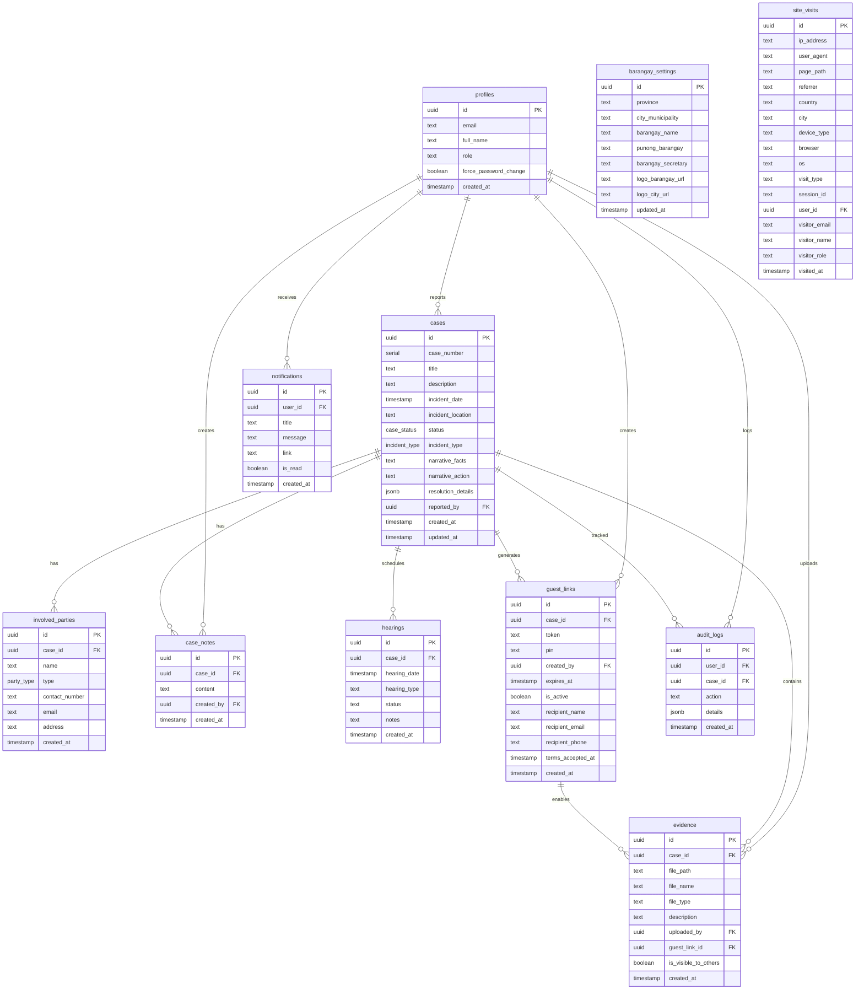

# ⚖️ BlotterSys - Modern Barangay Incident Management


**BlotterSys** is a next-generation web application designed to digitize and streamline the justice system at the Barangay level. It replaces traditional logbooks with a secure, cloud-based platform for managing incident reports, generating legal documents, and tracking case resolutions.

## ✨ Key Features

### 📂 Smart Case Management

- **Digital Blotter**: Record and track incidents with a structured workflow (Filed -> Hearing -> Amicable Settlement -> Certificate to File Action).
- **Status Tracking**: Track case progress from filing to resolution.
- **Search & Filter**: Instantly retrieve cases by case number, name, or date.

### 🖨️ Automated Document Generation

- **One-Click Printing**: Generate official DILG-compliant forms instantly:
  - _Summons_
  - _Notice of Hearing_
  - _Amicable Settlement_
  - _Certificate to File Action_
- **PDF Export**: Download documents for offline archiving.

### 🔐 Secure Evidence Vault

- **Magic Links**: Send time-limited, secure upload links to residents via email.
- **Guest Uploads**: Residents can upload photos/videos without creating an account.
- **Bank-Grade Security**: All evidence is encrypted and stored securely via Supabase Storage.

### 📊 Analytics Dashboard

- **Insightful Metrics**: Track case volume, resolution rates, and common incident types.
- **Visual Reports**: Interactive charts powered by Recharts.

## 🛠️ Technology Stack

- **Framework**: [Next.js 16](https://nextjs.org/) (App Router)
- **Language**: [TypeScript](https://www.typescriptlang.org/)
- **Styling**: [Tailwind CSS 4](https://tailwindcss.com/)
- **Database & Auth**: [Supabase](https://supabase.com/)
- **Email Service**: [MailerSend](https://www.mailersend.com/)
- **UI Components**: [Flowbite](https://flowbite.com/) & [Lucide React](https://lucide.dev/)
- **Validation**: [Zod](https://zod.dev/)

<details>
<summary><strong>📋 Scope and Limitations (Click to Expand)</strong></summary>

### 1. System Scope

The system handles the digital management of barangay blotter cases, specifically focusing on the _Katarungang Pambarangay_ process.

#### 1.1 Core Functionalities

- **Digital Blotter**: Full lifecycle management of cases from filing to resolution (Filed → Hearing → Amicable Settlement/CFA → Closed).
- **Search & Retrieval**: Advanced filtering of cases by Case Number, Title, Date, Status, or Involved Parties.
- **Dashboard & Analytics**: Real-time visualization of case statistics, status distribution, and incident trends.
- **Audit Trails**: automatic logging of critical system actions (login, status changes, document generation) for accountability.

#### 1.2 User Roles & Access Control

- **Admin (Barangay Captain/Secretary)**: Full access to system settings, user management, audit logs, and all operational features.
- **Staff (Desk Officer/Kagawad)**: Operational access to file cases, schedule hearings, managing evidence, and generating documents.
- **Guest (Residents)**: Temporary, secure access to specific case details updates and an evidence upload portal via Magic Links.

#### 1.3 Document Handling

- **Automated Generation**: Instant creation of DILG-compliant PDF documents:
  - Summons
  - Notice of Hearing
  - Amicable Settlement
  - Certificate to File Action (CFA)
- **PDF Export**: Documents are rendered server-side and available for download/printing.

#### 1.4 Evidence Management

- **Secure Vault**: Encrypted cloud storage for case-related files.
- **Guest Portal**: A specialized, PIN-protected interface allowing non-users (residents) to upload evidence without creating an account.
- **Visibility Control**: Granular control over which evidence files are visible to other parties.

### 2. System Limitations

The following constraints define the boundaries of the system's capabilities, determined by technical architecture and configuration.

#### 2.1 Technical Constraints

- **Connectivity**: The system is cloud-native and requires an active internet connection to function; there is no offline mode.
- **Platform**: The system is a web application accessible via modern browsers (Chrome, Edge, Firefox, Safari). There is no native mobile application (iOS/Android), though the interface is responsive.
- **Dependencies**: The system relies on third-party services:
  - **Supabase**: For database, authentication, and file storage.
  - **MailerSend**: For sending transactional emails (magic links, notifications).

#### 2.2 Storage & Upload Limits

Strict limits are enforced to maintain system performance and storage quotas:

| Feature               | Limit Description                         | Value                                        |
| :-------------------- | :---------------------------------------- | :------------------------------------------- |
| **Guest Upload Size** | Maximum file size for guest uploads       | **5 MB** per file                            |
| **Guest file Count**  | Maximum files a guest can upload per link | **3 files**                                  |
| **Staff Upload Size** | Maximum file size for staff/admin uploads | **10 MB** per file                           |
| **Staff File Count**  | Maximum files staff can attach to a case  | **20 files**                                 |
| **File Types**        | Allowed formats for Evidence              | **JPEG, PNG, WebP** (Images), **PDF** (Docs) |

#### 2.3 Operational Constraints

- **Guest Access Duration**: Guest links are temporary. They default to **24 hours** and cannot exceed **7 days**.
- **Guest Link Limit**: A maximum of **5 active guest links** can be generated per case at any one time.
- **Terminal States**: Once a case is marked as _Settled_, _Closed_, _Dismissed_, or _Referred_, it becomes **read-only**. No further edits or uploads are permitted unless reopened.
- **Rate Limiting**:
  - **Login**: Max **5 failed attempts** per 15 minutes.
  - **Guest PIN**: Max **3 failed attempts** per 10 minutes.

#### 2.4 Jurisdiction

- **Legal Scope**: The system is designed specifically for the _Katarungang Pambarangay_ law (RA 7160) and is not intended for police blotters or court-level case management.

</details>

<details>
<summary><strong>🔧 Technical Background (Click to Expand)</strong></summary>

### 1. Technology Stack

This section outlines the software development tools, frameworks, and libraries utilized in the development of _BlotterSys_. The selection of these technologies was driven by the requirements for performance, scalability, type safety, and rapid development.

#### 1.1 Frontend Technologies

The client-side architecture is built upon a modern React ecosystem, leveraging server-side rendering for optimal performance and SEO.

| Technology       | Version | Role / Justification                                                                                                                                            |
| :--------------- | :------ | :-------------------------------------------------------------------------------------------------------------------------------------------------------------- |
| **Next.js**      | 16.0.7  | **Core Framework.** Selected for its App Router architecture, server-side rendering (SSR), and built-in API routes, which unify the frontend and backend logic. |
| **React**        | 19.2.1  | **UI Library.** Provides the component-based architecture. Version 19 introduces improved concurrency and server action support.                                |
| **TypeScript**   | 5.x     | **Language.** Enforces static typing to reduce runtime errors and improve code maintainability for complex logic like case management.                          |
| **Tailwind CSS** | 4.0     | **Styling Engine.** A utility-first CSS framework used for rapid UI development and ensuring consistent design tokens.                                          |
| **Flowbite**     | 4.0.1   | **Component Library.** Provides pre-built, accessible UI components (modals, tables) compatible with Tailwind CSS.                                              |
| **Recharts**     | 3.5.1   | **Data Visualization.** Used for rendering responsive charts in the analytics dashboard.                                                                        |
| **Zod**          | 4.1.13  | **Schema Validation.** Ensures runtime data integrity for form inputs and API request payloads.                                                                 |
| **Lucide React** | 0.555.0 | **Iconography.** A lightweight, consistent icon set used throughout the interface.                                                                              |

#### 1.2 Backend Services & Infrastructure

The system employs a serverless and cloud-native approach to minimize infrastructure maintenance while ensuring high availability.

| Technology           | Version | Role / Justification                                                                                                  |
| :------------------- | :------ | :-------------------------------------------------------------------------------------------------------------------- |
| **Node.js**          | 20+     | **Runtime Environment.** Executes JavaScript code on the server side.                                                 |
| **Supabase**         | Cloud   | **Backend-as-a-Service (BaaS).** Provides the PostgreSQL database, authentication system, and object storage.         |
| **PostgreSQL**       | 15+     | **Database.** An advanced, open-source relational database used for structured data storage (cases, users, evidence). |
| **Supabase Auth**    | v2      | **Identity Management.** Handles secure user authentication, session management, and JWT issuance.                    |
| **Supabase Storage** | v2      | **Object Storage.** Securely stores binary large objects (BLOBs) such as evidence photos and PDF documents.           |
| **MailerSend**       | 2.6.0   | **Email Service.** A transactional email API used for sending secure guest links and system notifications.            |
| **Puppeteer**        | 24.32.0 | **PDF Engine.** A headless Chrome Node.js API used to generate high-fidelity PDF legal documents from HTML templates. |

#### 1.3 Development & Quality Assurance Tools

| Tool                      | Role                                                                                    |
| :------------------------ | :-------------------------------------------------------------------------------------- |
| **ESLint**                | Static code analysis tool for identifying patterns found in ECMAScript/JavaScript code. |
| **Git**                   | Distributed version control system for tracking changes in source code.                 |
| **Rate-Limiter-Flexible** | Library used to implement DDoS protection and bruteforce prevention on login endpoints. |

### 2. Software Architecture

The system follows a **Monolithic implementation within a Serverless environment**, utilizing the **Next.js App Router** pattern. This architecture blends frontend UI and backend logic into a single cohesive codebase while leveraging cloud services for persistence and state.

#### 2.1 Architectural Patterns

1.  **Server Components (RSC):**
    - _Description:_ Components that render exclusively on the server.
    - _Usage:_ Used for data fetching (e.g., retrieving case lists) to reduce client-side JavaScript bundles and improve initial page load (FCP).

2.  **Server Actions:**
    - _Description:_ Asynchronous functions executed on the server, callable directly from client components.
    - _Usage:_ Replaces traditional REST API endpoints for form submissions (e.g., `createCase`, `updateStatus`), ensuring type safety and reducing boilerplate.

3.  **Row-Level Security (RLS):**
    - _Description:_ A security pattern where access policies are defined directly on the database tables.
    - _Usage:_ Ensures that users can strictly access only the data permitted by their role (Admin vs. Staff) and tenant (Barangay), regardless of the access vector (API or Dashboard).

### 3. Database Schema Design

The persistence layer is built on a **Relational Database Management System (RDBMS)** schema.

#### 3.1 Core Entities

- **Profiles**: Extends the auth system with application-specific user data (Roles: Admin/Staff).
- **Blotter_Cases**: The central entity storing incident details, status, and metadata.
- **Involved_Parties**: Stores normalized data about complainants, respondents, and witnesses, linked to cases via Foreign Key.
- **Evidence**: Metadata for files stored in the object storage, linked to specific cases.
- **Guest_Links**: Validates and tracks the temporary access tokens issued to non-system users.

#### 3.2 Security Implementation

- **Encryption at Rest**: Data is stored on encrypted volumes.
- **Encryption in Transit**: All connections are enforced via TLS 1.2+.
- **Audit Logging**: Database triggers automatically record `INSERT`, `UPDATE`, and `DELETE` operations into an immutable `audit_logs` table for forensic capability.

### 4. External Interfaces

#### 4.1 MailerSend API

Restful API integration for delivering transactional emails. It is used primarily for the **Guest Evidence Upload** workflow, delivering time-sensitive "Magic Links" to residents.

#### 4.2 Puppeteer Renderer

An internal micro-service abstraction that launches a headless Chromium instance to render HTML/CSS templates into PDF buffers. This ensures that legal documents (Summons, CFA) match exact formatting requirements regardless of the client device.

### 5. System Requirements

#### 5.1 Deployment Environment

- **Runtime**: Node.js 18.x or higher.
- **Memory**: Minimum 1GB RAM (for Puppeteer PDF generation).
- **Storage**: Ephemeral filesystem support (for temporary file processing).

#### 5.2 Client Requirements

- **Browser**: Modern evergreen browser (Chrome 90+, Firefox 90+, Safari 14+, Edge).
- **Network**: Broadband internet connection (required for real-time database connectivity).

</details>

## 🗄️ Database Schema

BlotterSys uses a PostgreSQL database hosted on Supabase with 11 interconnected tables that handle case management, user authentication, evidence storage, and system configuration. The schema is designed with Row Level Security (RLS) policies to ensure data privacy and role-based access control.

<details>
<summary><strong>🗄️ Database Schema & ERD (Click to Expand)</strong></summary>

### Entity Relationship Diagram



### Key Enumerations

| Enum Type          | Allowed Values                                                                                          | Usage                            |
| ------------------ | ------------------------------------------------------------------------------------------------------- | -------------------------------- |
| **case_status**    | `New`, `Under Investigation`, `Hearing Scheduled`, `Settled`, `Closed`, `Dismissed`, `Referred`         | Tracks case lifecycle status     |
| **party_type**     | `Complainant`, `Respondent`, `Witness`                                                                  | Defines role of involved parties |
| **incident_type**  | `Theft`, `Harassment`, `Vandalism`, `Physical Injury`, `Property Damage`, `Public Disturbance`, `Other` | Categorizes incident types       |
| **hearing_type**   | `Mediation`, `Conciliation`, `Arbitration`                                                              | Defines hearing format           |
| **hearing_status** | `Scheduled`, `Completed`, `No Show`, `Rescheduled`, `Settled`                                           | Tracks hearing outcome           |

### Storage Buckets

| Bucket       | Access  | Purpose             | RLS Policies                           |
| ------------ | ------- | ------------------- | -------------------------------------- |
| **branding** | Public  | Barangay/City logos | ✅ Authenticated upload, Public read   |
| **evidence** | Private | Case evidence files | ✅ Authenticated only, Guest via token |

### Security Features

- **Row Level Security (RLS)**: All tables have RLS enabled with role-based policies
- **Cascade Deletion**: Deleting a case automatically removes related parties, notes, evidence, and hearings
- **Audit Triggers**: Case status changes auto-log to `audit_logs`
- **Guest Link Auto-Expiry**: Links automatically deactivate when case status becomes terminal (`Settled`, `Closed`, `Dismissed`, `Referred`)

</details>

### Input Validation & UX Enhancements

The system implements comprehensive input validation and user experience improvements:

#### Name Input Validation (Involved Parties)

| Rule               | Implementation                                                                    |
| ------------------ | --------------------------------------------------------------------------------- |
| **Required**       | Field cannot be empty                                                             |
| **Min Length**     | Minimum 2 characters                                                              |
| **Max Length**     | Maximum 100 characters                                                            |
| **Letters Only**   | Only alphabetic characters (A-Z, a-z) allowed                                     |
| **Spaces Allowed** | Spaces permitted for first, middle, last names                                    |
| **Special Chars**  | Hyphens (`-`) and apostrophes (`'`) allowed for names like "O'Brien", "Mary-Jane" |
| **No Numbers**     | Numeric characters are rejected                                                   |
| **Auto-Trim**      | Leading/trailing whitespace automatically removed                                 |
| **Title Case**     | Names auto-formatted to Title Case (e.g., "JOHN DOE" → "John Doe")                |
| **Inline Errors**  | Real-time validation feedback with red border and error message                   |

#### Confirmation Dialogs

Critical user actions require confirmation to prevent accidental operations:

| Action              | Modal Type    | Description                                              |
| ------------------- | ------------- | -------------------------------------------------------- |
| **Sign Out**        | Warning Modal | "Are you sure you want to sign out?" with Cancel/Confirm |
| **Delete Case**     | Danger Modal  | Requires explicit confirmation before deletion           |
| **Terminal Status** | Warning Modal | Confirms locking case when marking as Settled/Closed     |

> 💡 **For Developers**: Full schema with indexes, functions, and triggers available in [`supabase/schema.sql`](file:///c:/Users/kuyag/OneDrive/Desktop/Final/Final/supabase/schema.sql)

## 🚀 Getting Started

### Prerequisites

- Node.js 18+
- npm or yarn
- A Supabase project
- A MailerSend account (for email notifications)

### Installation

1.  **Clone the repository**

    ```bash
    git clone https://github.com/yourusername/blottersys.git
    cd blottersys
    ```

2.  **Install dependencies**

    ```bash
    npm install
    ```

3.  **Environment Setup**
    Create a `.env.local` file in the root directory and add the following keys:

    ```env
    # Supabase Configuration
    NEXT_PUBLIC_SUPABASE_URL=your_supabase_project_url
    NEXT_PUBLIC_SUPABASE_ANON_KEY=your_supabase_anon_key

    # MailerSend Configuration (for Guest Links)
    MAILERSEND_API_KEY=your_mailersend_api_key
    MAILERSEND_FROM_EMAIL=noreply@yourdomain.com
    MAILERSEND_FROM_NAME="BlotterSys Notification"
    ```

4.  **Run the development server**

    ```bash
    npm run dev
    ```

5.  **Access the Application**
    Open [http://localhost:3000](http://localhost:3000) in your browser.

## 📂 Project Structure

```
├── app/                # Next.js App Router pages and API routes
│   ├── api/            # Backend API endpoints
│   ├── dashboard/      # Protected dashboard views
│   └── guest/          # Public-facing guest upload pages
├── components/         # Reusable UI components
├── lib/                # Library configurations (Supabase, Utils)
├── supabase/           # Database schema and migrations
├── types/              # TypeScript type definitions
└── utils/              # Helper functions
```

## 🔒 Security & Privacy

- **Row Level Security (RLS)**: Strictly enforces data access policies at the database level.
- **Audit Logging**: Every action (create, update, delete) is logged for accountability.
- **Data Encryption**: Sensitive data is encrypted in transit and at rest.

## 📊 Use Case Diagram & System Flowchart

<details>
<summary><strong>📊 Use Case Diagram & System Flowchart (Click to Expand)</strong></summary>

This section provides a visual overview of how different users interact with BlotterSys and how the system processes cases from start to finish.

---

### 👥 System Actors

BlotterSys has three main types of users, each with specific roles and permissions:

#### 1. **Admin** (Barangay Captain/Secretary)

- **Access Level**: Full system control
- **Key Responsibilities**:
  - Configure barangay settings (logos, official names)
  - Manage user accounts (create staff, assign roles)
  - View audit logs and security reports
  - Access all features available to Staff
- **Unique Capabilities**:
  - System settings configuration
  - Audit log access
  - Site visit analytics
  - User role management

#### 2. **Staff** (Desk Officer/Kagawad)

- **Access Level**: Operational access
- **Key Responsibilities**:
  - File and manage blotter cases
  - Generate legal documents (Summons, CFA, etc.)
  - Create guest links for evidence collection
  - Update case status and add notes
- **Restrictions**:
  - Cannot access system settings
  - Cannot view audit logs
  - Cannot manage user accounts

#### 3. **Guest** (Resident/Complainant/Respondent)

- **Access Level**: Limited, link-based
- **Key Responsibilities**:
  - Upload evidence (photos) for assigned case
  - View case narrative and hearing schedule
- **Access Method**:
  - Receives email with magic link + 6-digit PIN
  - No account creation required
  - Time-limited access (24-72 hours)

---

### 🎯 Use Case Diagram

The following diagram shows all possible interactions between actors and the system, organized by access level:


**Legend**:

- **Blue (Admin)** = Full system access
- **Orange (Staff)** = Operational access only
- **Purple (Guest)** = Limited, link-based access
- **Red boxes** = Admin-only features

---

### 🔄 System Flowcharts (Role-Based Subprocesses)

BlotterSys workflows are organized into **4 role-based subprocess flowcharts**. Each subprocess represents a distinct user journey through the system.

| Subprocess       | Actor(s)      | Description                   |
| ---------------- | ------------- | ----------------------------- |
| **Subprocess 1** | All Users     | System Entry & Authentication |
| **Subprocess 2** | Admin Only    | Administrative Functions      |
| **Subprocess 3** | Admin + Staff | Operational Case Management   |
| **Subprocess 4** | Guest Only    | Evidence Upload Portal        |

---

#### 🔐 Subprocess 1: System Entry & Authentication

**Actor:** All Users (Admin, Staff, Guest)  
**Purpose:** Entry point for all users - authentication and role-based routing


---

#### 👑 Subprocess 2: Admin-Only Functions

**Actor:** Admin Only  
**Purpose:** System configuration, user management, and audit functions


---

#### 📂 Subprocess 3: Operational Case Management

**Actor:** Admin + Staff (Shared)  
**Purpose:** Core case management, document generation, and evidence handling


---

#### 👤 Subprocess 4: Guest Evidence Upload Portal

**Actor:** Guest Only (via Magic Link)  
**Purpose:** Secure evidence upload for case-related residents


---

### 🔗 Subprocess Connection Map

```
┌───────────────────────────────────────────────────────────────┐
│           SUBPROCESS 1: ENTRY & AUTHENTICATION                │
│                    (All Users Start Here)                     │
└──────────┬────────────────────────────────────┬───────────────┘
           │                                    │
           ▼                                    ▼
┌──────────────────────┐              ┌─────────────────────────┐
│   Role: ADMIN        │              │   Role: GUEST           │
│   ┌──────────────┐   │              │                         │
│   │ SUBPROCESS 2 │   │              │   ┌─────────────────┐   │
│   │ Admin-Only   │   │              │   │ SUBPROCESS 4    │   │
│   │ Functions    │   │              │   │ Guest Portal    │   │
│   └──────┬───────┘   │              │   │ (Evidence Upload)│   │
│          │           │              │   └─────────────────┘   │
│          ▼           │              └─────────────────────────┘
│   ┌──────────────┐   │
│   │ SUBPROCESS 3 │   │       ┌─────────────────────────┐
│   │ Operations   │◄──┼───────│   Role: STAFF           │
│   │ (Shared)     │   │       │                         │
│   └──────────────┘   │       │   ┌─────────────────┐   │
└──────────────────────┘       │   │ SUBPROCESS 3    │   │
                               │   │ Operations      │   │
                               │   │ (Case Mgmt)     │   │
                               │   └─────────────────┘   │
                               └─────────────────────────┘
```

---

### 🔐 Security Checkpoints

Throughout the system, these security measures are enforced:

| Checkpoint                   | Description                         | Enforcement             |
| ---------------------------- | ----------------------------------- | ----------------------- |
| **Login Rate Limiting**      | Max 5 login attempts per 15 minutes | `rate-limiter-flexible` |
| **PIN Rate Limiting**        | Max 3 PIN attempts per 10 minutes   | `rate-limiter-flexible` |
| **Row Level Security (RLS)** | Database-level access control       | Supabase RLS policies   |
| **Session Validation**       | Verify user session on each request | Supabase Auth           |
| **Guest Link Expiration**    | Auto-expire links after duration    | Database trigger        |
| **Case Lock**                | Prevent edits to terminal cases     | Application logic       |
| **Audit Logging**            | Log all critical actions            | Database trigger        |

---

### 🏗️ System Architecture Diagram

The following diagram shows the high-level system architecture and component relationships:


**Technology Stack Summary:**

| Layer          | Technology              | Purpose                            |
| -------------- | ----------------------- | ---------------------------------- |
| Frontend       | Next.js 16 (React 19)   | Server-side rendering, App Router  |
| Styling        | Tailwind CSS 4          | Utility-first CSS framework        |
| UI Components  | Flowbite + Lucide React | Pre-built components and icons     |
| Database       | PostgreSQL (Supabase)   | Relational data storage with RLS   |
| Authentication | Supabase Auth           | JWT-based session management       |
| File Storage   | Supabase Storage        | Encrypted evidence files           |
| Email          | MailerSend API          | Transactional emails (guest links) |
| PDF Generation | Puppeteer               | Server-side document rendering     |
| Validation     | Zod                     | Runtime type validation            |

</details>

<details>
<summary><strong>🔄 Data Flow Diagram (Click to Expand)</strong></summary>

### System Data Flow

This diagram illustrates how data moves through the **BlotterSys** ecosystem, connecting users, internal processes, and external services.


</details>

---

### 🔄 Case Status State Machine

The following state machine diagram shows valid case status transitions:


**Status Definitions:**

| Status                  | Description                      | Editable  | Guest Links    |
| ----------------------- | -------------------------------- | --------- | -------------- |
| **New**                 | Case just filed, awaiting action | ✅ Yes    | ✅ Active      |
| **Under Investigation** | Case is being investigated       | ✅ Yes    | ✅ Active      |
| **Hearing Scheduled**   | Hearing date set                 | ✅ Yes    | ✅ Active      |
| **Settled**             | Resolved via amicable settlement | ❌ Locked | ❌ Deactivated |
| **Closed**              | Case closed by authority         | ❌ Locked | ❌ Deactivated |
| **Dismissed**           | Case dismissed (no merit)        | ❌ Locked | ❌ Deactivated |
| **Referred**            | Referred to higher authority     | ❌ Locked | ❌ Deactivated |

---

### 📡 Sequence Diagram: Guest Evidence Upload

The following sequence diagram illustrates the interaction flow when a guest uploads evidence:


---

## 📋 Functional Requirements

### FR-1: User Authentication & Authorization

| ID     | Requirement                                                          | Priority |
| ------ | -------------------------------------------------------------------- | -------- |
| FR-1.1 | System shall support email/password authentication via Supabase Auth | High     |
| FR-1.2 | System shall implement role-based access control (Admin, Staff)      | High     |
| FR-1.3 | System shall force password change on first login                    | Medium   |
| FR-1.4 | System shall rate-limit login attempts (max 5 per 15 minutes)        | High     |
| FR-1.5 | System shall maintain user sessions with automatic expiration        | High     |

### FR-2: Case Management

| ID     | Requirement                                                            | Priority |
| ------ | ---------------------------------------------------------------------- | -------- |
| FR-2.1 | System shall allow filing of new blotter cases with incident details   | High     |
| FR-2.2 | System shall generate unique sequential case numbers                   | High     |
| FR-2.3 | System shall track case status through defined lifecycle               | High     |
| FR-2.4 | System shall support multiple involved parties per case                | High     |
| FR-2.5 | System shall allow adding internal notes to cases                      | Medium   |
| FR-2.6 | System shall prevent editing of terminal cases (Settled, Closed, etc.) | High     |
| FR-2.7 | System shall support advanced search by case number, name, date        | High     |
| FR-2.8 | System shall auto-notify admins for high-priority incidents            | Medium   |

### FR-3: Document Generation

| ID     | Requirement                                                 | Priority |
| ------ | ----------------------------------------------------------- | -------- |
| FR-3.1 | System shall generate DILG-compliant Summons documents      | High     |
| FR-3.2 | System shall generate Notice of Hearing documents           | High     |
| FR-3.3 | System shall generate Amicable Settlement agreements        | High     |
| FR-3.4 | System shall generate Certificate to File Action documents  | High     |
| FR-3.5 | System shall output documents in PDF format                 | High     |
| FR-3.6 | System shall populate documents with case and barangay data | High     |

### FR-4: Evidence Management

| ID     | Requirement                                                                | Priority |
| ------ | -------------------------------------------------------------------------- | -------- |
| FR-4.1 | System shall allow secure file uploads (JPEG, PNG, WebP)                   | High     |
| FR-4.2 | System shall enforce file size limit of 5MB per upload                     | Medium   |
| FR-4.3 | System shall generate time-limited guest upload links                      | High     |
| FR-4.4 | System shall protect guest links with 6-digit PIN codes                    | High     |
| FR-4.5 | System shall auto-expire guest links after configured duration             | High     |
| FR-4.6 | System shall auto-deactivate guest links when case reaches terminal status | High     |
| FR-4.7 | System shall store evidence in encrypted cloud storage                     | High     |

### FR-5: Hearing Scheduling

| ID     | Requirement                                                                 | Priority |
| ------ | --------------------------------------------------------------------------- | -------- |
| FR-5.1 | System shall allow scheduling hearings with date and type                   | High     |
| FR-5.2 | System shall support multiple hearing types (Mediation, Conciliation, etc.) | Medium   |
| FR-5.3 | System shall display upcoming hearings in dashboard calendar                | High     |
| FR-5.4 | System shall track hearing status (Scheduled, Completed, etc.)              | Medium   |
| FR-5.5 | System shall allow adding notes to hearing records                          | Low      |

### FR-6: Analytics & Reporting

| ID     | Requirement                                          | Priority |
| ------ | ---------------------------------------------------- | -------- |
| FR-6.1 | System shall display case status distribution charts | Medium   |
| FR-6.2 | System shall display incident type frequency charts  | Medium   |
| FR-6.3 | System shall display monthly case trends             | Medium   |
| FR-6.4 | System shall allow filtering analytics by date range | Medium   |
| FR-6.5 | System shall show comparison with previous period    | Low      |
| FR-6.6 | System shall track site visit analytics              | Low      |

### FR-7: System Configuration

| ID     | Requirement                                                 | Priority |
| ------ | ----------------------------------------------------------- | -------- |
| FR-7.1 | System shall allow admins to configure barangay information | High     |
| FR-7.2 | System shall support uploading barangay and city logos      | Medium   |
| FR-7.3 | System shall allow managing user accounts                   | High     |
| FR-7.4 | System shall maintain audit logs of all critical actions    | High     |
| FR-7.5 | System shall allow viewing audit trail by user and date     | Medium   |

---

## ⚙️ Non-Functional Requirements

### NFR-1: Performance

| ID      | Requirement                                                           | Target    |
| ------- | --------------------------------------------------------------------- | --------- |
| NFR-1.1 | Page load time shall not exceed 3 seconds on average                  | ≤ 3s      |
| NFR-1.2 | Database queries shall execute in under 500ms for standard operations | ≤ 500ms   |
| NFR-1.3 | PDF generation shall complete within 5 seconds                        | ≤ 5s      |
| NFR-1.4 | File uploads shall support up to 5MB files                            | 5MB max   |
| NFR-1.5 | System shall handle up to 100 concurrent users                        | 100 users |

### NFR-2: Security

| ID      | Requirement                                                     | Standard |
| ------- | --------------------------------------------------------------- | -------- |
| NFR-2.1 | All data transmission shall use HTTPS/TLS encryption            | TLS 1.2+ |
| NFR-2.2 | Passwords shall be hashed using bcrypt or equivalent            | Bcrypt   |
| NFR-2.3 | Row-level security policies shall be enforced at database level | RLS      |
| NFR-2.4 | System shall implement CSRF protection on all forms             | CSRF     |
| NFR-2.5 | Sensitive files shall be stored in private, encrypted buckets   | AES-256  |
| NFR-2.6 | System shall log all authentication attempts                    | Audit    |
| NFR-2.7 | Guest access shall be time-limited and PIN-protected            | Required |

### NFR-3: Reliability

| ID      | Requirement                                                  | Target    |
| ------- | ------------------------------------------------------------ | --------- |
| NFR-3.1 | System uptime shall be at least 99.5%                        | 99.5%     |
| NFR-3.2 | Data backups shall occur daily                               | Daily     |
| NFR-3.3 | System shall handle database connection failures gracefully  | Resilient |
| NFR-3.4 | Failed operations shall provide user-friendly error messages | Required  |

### NFR-4: Usability

| ID      | Requirement                                                  | Standard |
| ------- | ------------------------------------------------------------ | -------- |
| NFR-4.1 | Interface shall be responsive on desktop, tablet, and mobile | Required |
| NFR-4.2 | Forms shall provide real-time validation feedback            | Required |
| NFR-4.3 | Critical actions shall require confirmation dialogs          | Required |
| NFR-4.4 | System shall provide loading indicators for async operations | Required |
| NFR-4.5 | Error messages shall be clear and actionable                 | Required |

### NFR-5: Maintainability

| ID      | Requirement                                              | Standard |
| ------- | -------------------------------------------------------- | -------- |
| NFR-5.1 | Code shall follow TypeScript best practices              | Required |
| NFR-5.2 | Database schema shall support migration versioning       | Required |
| NFR-5.3 | System shall use environment variables for configuration | Required |
| NFR-5.4 | Components shall be modular and reusable                 | Required |

### NFR-6: Scalability

| ID      | Requirement                                               | Target |
| ------- | --------------------------------------------------------- | ------ |
| NFR-6.1 | Database shall support at least 100,000 cases             | 100K+  |
| NFR-6.2 | File storage shall support at least 1TB of evidence files | 1TB+   |
| NFR-6.3 | System architecture shall support horizontal scaling      | Cloud  |

### NFR-7: Compliance

| ID      | Requirement                                                        | Standard |
| ------- | ------------------------------------------------------------------ | -------- |
| NFR-7.1 | Documents shall comply with DILG formatting standards              | DILG     |
| NFR-7.2 | System shall comply with Data Privacy Act of 2012 (Philippines)    | DPA 2012 |
| NFR-7.3 | Audit logs shall be retained for at least 2 years                  | 2 years  |
| NFR-7.4 | Guest terms and conditions must be accepted before evidence upload | Required |

---

## 📄 License

This project is proprietary software developed for Local Government Units. Unauthorized reproduction or distribution is strictly prohibited.

---

© 2025 BlotterSys™ Inc. All Rights Reserved.
