# 🔄 Data Flow Diagram

## 1. System Data Flow

This diagram illustrates how data moves through the **BlotterSys** ecosystem, connecting users, internal processes, and external services. It highlights the flow of information for key operations such as case filing, evidence management, and document generation.

### 1.1 High-Level Data Flow

```mermaid
graph TD
    %% Entities
    UserAdmin[👤 Admin]
    UserStaff[👤 Staff]
    UserGuest[👤 Guest / Resident]

    %% External Services
    MailerSend[📧 MailerSend API]

    %% System Boundaries
    subgraph "BlotterSys System"
        direction TB

        %% Processes
        ProcAuth[🔐 Authentication & RBAC]
        ProcCaseMgmt[📂 Case Management]
        ProcDocGen[🖨️ Document Generator]
        ProcEvidence[📸 Evidence Handler]
        ProcNotify[🔔 Notification Service]

        %% Data Stores
        DB[(🗄️ Supabase DB)]
        Storage[(☁️ Supabase Storage)]
    end

    %% Data Flows

    %% Auth Flow
    UserAdmin & UserStaff -->|Credentials| ProcAuth
    ProcAuth <-->|Verify / Create Session| DB
    ProcAuth -->|Token| UserAdmin & UserStaff

    %% Case Management Flow
    UserStaff -->|File Case / Update Status| ProcCaseMgmt
    ProcCaseMgmt -->|Persist Case Data| DB
    DB -->|Retrieved Case Data| ProcCaseMgmt

    %% Document Generation Flow
    UserStaff -->|Request Document| ProcDocGen
    ProcDocGen -->|Fetch Template Data| DB
    ProcDocGen -->|Generate PDF| UserStaff

    %% Evidence Flow (Staff)
    UserStaff -->|Upload Files| ProcEvidence
    ProcEvidence -->|Store Metadata| DB
    ProcEvidence -->|Store Binary| Storage

    %% Evidence Flow (Guest)
    UserAdmin & UserStaff -->|Generate Magic Link| ProcEvidence
    ProcEvidence -->|Link Details| DB
    ProcEvidence -->|Send Link via Email| ProcNotify
    ProcNotify -->|Dispatch Request| MailerSend
    MailerSend -->|Email Delivery| UserGuest

    UserGuest -->|Access Link + Upload| ProcEvidence
    ProcEvidence -->|Validate Token| DB

    %% Read / View Flows
    UserAdmin -->|View Audit Logs| DB
    UserStaff -->|Search Cases| DB

    %% Styling
    style UserAdmin fill:#e3f2fd,stroke:#1976d2
    style UserStaff fill:#fff3e0,stroke:#f57c00
    style UserGuest fill:#f3e5f5,stroke:#7b1fa2
    style DB fill:#e0f2f1,stroke:#00695c
    style Storage fill:#e0f2f1,stroke:#00695c
    style MailerSend fill:#ffebee,stroke:#c62828
```

## 2. Process Descriptions

### 2.1 Authentication & RBAC

- **Inputs**: User credentials (Email/Password).
- **Processing**: Supabase Auth verifies credentials and issues a JSON Web Token (JWT).
- **Outputs**: Session token, User Role (Admin/Staff).

### 2.2 Case Management

- **Inputs**: Incident details, involved parties, narrative.
- **Processing**: Input validation (Zod), status transitions, audit logging.
- **Outputs**: New case record, updated status, case number.

### 2.3 Evidence Handling (Guest Uploads)

- **Inputs**: Guest Link generation request.
- **Processing**:
  1.  System generates a secure, time-limited token.
  2.  MailerSend delivers the link to the resident.
  3.  Resident uploads files via the public portal.
  4.  System validates the token and sanitizes files.
  5.  Files are stored in Supabase Storage buckets.
- **Outputs**: Stored file URL, metadata record, email notification.

### 2.4 Document Generator

- **Inputs**: Case ID, Document Type (e.g., Summons).
- **Processing**: Puppeteer fetches data, populates HTML templates, and renders PDF.
- **Outputs**: Downloadable PDF file.
