# 🔄 System Flowcharts (Role-Based Subprocesses)

Blotter Sys workflows are organized into **4 role-based subprocess flowcharts**. Each subprocess represents a distinct user journey through the system.

| Subprocess       | Actor(s)      | Description                   |
| ---------------- | ------------- | ----------------------------- |
| **Subprocess 1** | All Users     | System Entry & Authentication |
| **Subprocess 2** | Admin Only    | Administrative Functions      |
| **Subprocess 3** | Admin + Staff | Operational Case Management   |
| **Subprocess 4** | Guest Only    | Evidence Upload Portal        |

---

## 🔐 Subprocess 1: System Entry & Authentication

**Actor:** All Users (Admin, Staff, Guest)  
**Purpose:** Entry point for all users - authentication and role-based routing

---

## 👑 Subprocess 2: Admin-Only Functions

**Actor:** Admin Only  
**Purpose:** System configuration, user management, and audit functions

---

## 📂 Subprocess 3: Operational Case Management

**Actor:** Admin + Staff (Shared)  
**Purpose:** Core case management, document generation, and evidence handling

---

## 👤 Subprocess 4: Guest Evidence Upload Portal

**Actor:** Guest Only (via Magic Link)  
**Purpose:** Secure evidence upload for case-related residents

---

## 🔗 Subprocess Connection Map

```mermaid
flowchart TB
    %% Entry point
    Start([All Users Start Here])
    
    %% Subprocess 1
    SP1["🔐 SUBPROCESS 1<br/>Entry & Authentication<br/>(All Users)"]
    
    %% Role decision
    RoleDecision{User Role?}
    
    %% Admin path
    AdminRole["👑 Admin Role"]
    SP2["⚙️ SUBPROCESS 2<br/>Admin Functions<br/>(System Config, Users, Audit)"]
    
    %% Staff path
    StaffRole["👤 Staff Role"]
    
    %% Shared operations
    SP3["📂 SUBPROCESS 3<br/>Case Operations<br/>(Admin + Staff Shared)"]
    
    %% Guest path
    GuestRole["👥 Guest Role"]
    SP4["🔗 SUBPROCESS 4<br/>Guest Portal<br/>(Evidence Upload)"]
    
    %% Connections
    Start --> SP1
    SP1 --> RoleDecision
    
    RoleDecision -->|Admin| AdminRole
    RoleDecision -->|Staff| StaffRole
    RoleDecision -->|Guest| GuestRole
    
    AdminRole --> SP2
    SP2 -->|Access Operations| SP3
    
    StaffRole --> SP3
    
    GuestRole --> SP4
    
    %% Styling
    style Start fill:#4CAF50,stroke:#2E7D32,color:#fff
    style SP1 fill:#2196F3,stroke:#1565C0,color:#fff
    style SP2 fill:#f44336,stroke:#c62828,color:#fff
    style SP3 fill:#FF9800,stroke:#E65100,color:#fff
    style SP4 fill:#9C27B0,stroke:#6A1B9A,color:#fff
    style RoleDecision fill:#FDD835,stroke:#F9A825
    style AdminRole fill:#ffcdd2,stroke:#d32f2f
    style StaffRole fill:#fff3e0,stroke:#f57c00
    style GuestRole fill:#f3e5f5,stroke:#7b1fa2
```

**Flow Description:**

1. **All users** start at **Subprocess 1** (Entry & Authentication)
2. After authentication, users route based on role:
   - **Admin** → Can access **Subprocess 2** (admin functions) AND **Subprocess 3** (operations)
   - **Staff** → Direct to **Subprocess 3** (operations only)
   - **Guest** → Direct to **Subprocess 4** (evidence upload portal)

---

## 🔐 Security Checkpoints

Throughout the system, these security measures are enforced:

| Checkpoint                   | Description                         | Enforcement             |
| ---------------------------- | ----------------------------------- | ----------------------- |
| **Login Rate Limiting**      | Max 5 login attempts per 15 minutes | `rate-limiter-flexible` |
| **PIN Rate Limiting**        | Max 3 PIN attempts per 10 minutes   | `rate-limiter-flexible` |
| **Row Level Security (RLS)** | Database-level access control       | Supabase RLS policies   |
| **Session Validation**       | Verify user session on each request | Supabase Auth           |
| **Guest Link Expiration**    | Auto-expire links after duration    | Database trigger        |
| **Case Lock**                | Prevent edits to terminal cases     | Application logic       |
| **Audit Logging**            | Log all critical actions            | Database trigger        |
