# 👥 Use Case Diagram

This diagram shows how different users (Admin, Staff, and Guest) interact with BlotterSys features.

## System Actors

BlotterSys has three main types of users:

| Actor | Access Level | Key Responsibilities |
|-------|--------------|---------------------|
| **Admin** | Full system control | Configure settings, manage users, access all features |
| **Staff** | Operational access | Case management, document generation, evidence handling |
| **Guest** | Limited link-based access | View case info, upload evidence via magic link |

---

## Use Case Diagram

```mermaid
graph TB
    subgraph Users["ACTORS"]
        Admin["Admin<br/>(Barangay Captain/Secretary)"]
        Staff["Staff<br/>(Desk Officer/Kagawad)"]
        Guest["Guest<br/>(Complainant/Respondent)"]
    end

    subgraph SharedFeatures["SHARED FEATURES (Admin + Staff)"]
        Login[Login/Logout]
        FileCase[File New Case]
        ManageCase[View/Search Cases]
        UpdateStatus[Update Case Status]
        AddNotes[Add Case Notes]
        ScheduleHearing[Schedule Hearing]
        GenerateDocs[Generate Documents]
        ManageEvidence[Manage Evidence]
        CreateGuestLink[Create Guest Link]
        ViewAnalytics[View Analytics]
        PeopleDirectory[People Directory]
    end

    subgraph AdminFeatures["ADMIN-ONLY FEATURES"]
        SystemSettings[System Settings]
        UserManagement[User Management]
        AuditLogs[Audit Logs]
    end

    subgraph GuestFeatures["GUEST FEATURES (Magic Link)"]
        ViewCaseInfo[View Case Narrative]
        ViewHearings[View Hearing Schedule]
        UploadEvidence[Upload Evidence]
        AcceptTerms[Accept Terms]
    end

    %% Admin connections
    Admin --> Login
    Admin --> FileCase
    Admin --> ManageCase
    Admin --> UpdateStatus
    Admin --> AddNotes
    Admin --> ScheduleHearing
    Admin --> GenerateDocs
    Admin --> ManageEvidence
    Admin --> CreateGuestLink
    Admin --> ViewAnalytics
    Admin --> PeopleDirectory
    Admin --> SystemSettings
    Admin --> UserManagement
    Admin --> AuditLogs


    %% Staff connections
    Staff --> Login
    Staff --> FileCase
    Staff --> ManageCase
    Staff --> UpdateStatus
    Staff --> AddNotes
    Staff --> ScheduleHearing
    Staff --> GenerateDocs
    Staff --> ManageEvidence
    Staff --> CreateGuestLink
    Staff --> ViewAnalytics
    Staff --> PeopleDirectory

    %% Guest connections
    Guest --> ViewCaseInfo
    Guest --> ViewHearings
    Guest --> UploadEvidence
    Guest --> AcceptTerms

    %% Styling
    style Admin fill:#e3f2fd,stroke:#1976d2
    style Staff fill:#fff3e0,stroke:#f57c00
    style Guest fill:#f3e5f5,stroke:#7b1fa2
    style SystemSettings fill:#ffcdd2,stroke:#d32f2f
    style UserManagement fill:#ffcdd2,stroke:#d32f2f
    style AuditLogs fill:#ffcdd2,stroke:#d32f2f
    style SiteAnalytics fill:#ffcdd2,stroke:#d32f2f
```

---

## Legend

| Color | Meaning |
|-------|---------|
| 🔵 **Blue (Admin)** | Full system access - can perform all operations |
| 🟠 **Orange (Staff)** | Operational access only - cannot manage system settings or users |
| 🟣 **Purple (Guest)** | Limited, link-based access - view and upload only |
| 🔴 **Red boxes** | Admin-only features - requires admin role |

---

## Feature Access Matrix

| Feature | Admin | Staff | Guest |
|---------|-------|-------|-------|
| **Authentication** |
| Login/Logout | ✅ | ✅ | ❌ |
| Magic Link Access | ❌ | ❌ | ✅ |
| **Case Management** |
| File New Case | ✅ | ✅ | ❌ |
| View/Search Cases | ✅ | ✅ | ✅ (Limited) |
| Update Case Status | ✅ | ✅ | ❌ |
| Add Case Notes | ✅ | ✅ | ❌ |
| Schedule Hearing | ✅ | ✅ | ❌ |
| **Documents** |
| Generate Documents | ✅ | ✅ | ❌ |
| View Hearing Schedule | ✅ | ✅ | ✅ |
| **Evidence** |
| Manage Evidence | ✅ | ✅ | ❌ |
| Upload Evidence | ✅ | ✅ | ✅ |
| **Guest Access** |
| Create Guest Link | ✅ | ✅ | ❌ |
| View Case Narrative | ✅ | ✅ | ✅ |
| Accept Terms | ❌ | ❌ | ✅ |
| **Analytics** |
| View Analytics | ✅ | ✅ | ❌ |
| People Directory | ✅ | ✅ | ❌ |
| **System Administration** |
| System Settings | ✅ | ❌ | ❌ |
| User Management | ✅ | ❌ | ❌ |
| Audit Logs | ✅ | ❌ | ❌ |

---

## User Journey Summary

### Admin Journey
1. Login → Dashboard
2. Full access to all features
3. Can manage system settings and users
4. Can perform all case operations
5. Has access to audit logs and analytics

### Staff Journey
1. Login → Dashboard
2. Access to operational features only
3. Can manage cases, hearings, and evidence
4. Can generate guest links
5. Cannot modify system settings or manage users

### Guest Journey
1. Receive email with magic link
2. Click link → Enter PIN
3. Accept terms and conditions
4. View case information
5. Upload evidence (photos/documents)
6. Limited to specific case only
