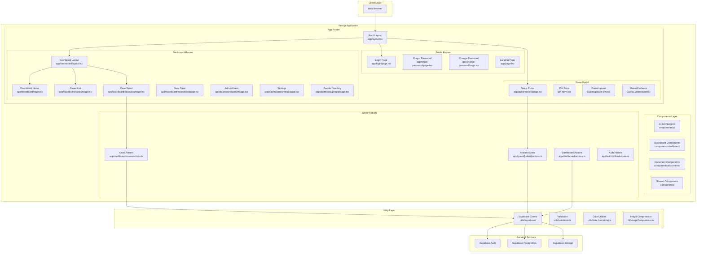
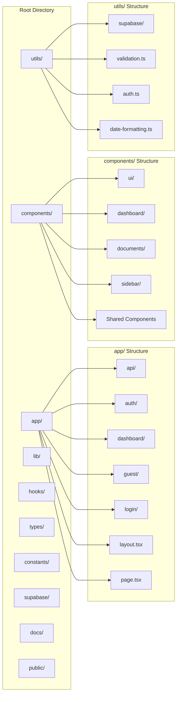
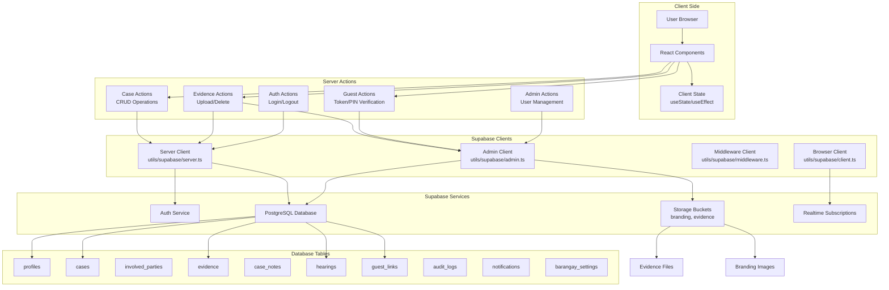
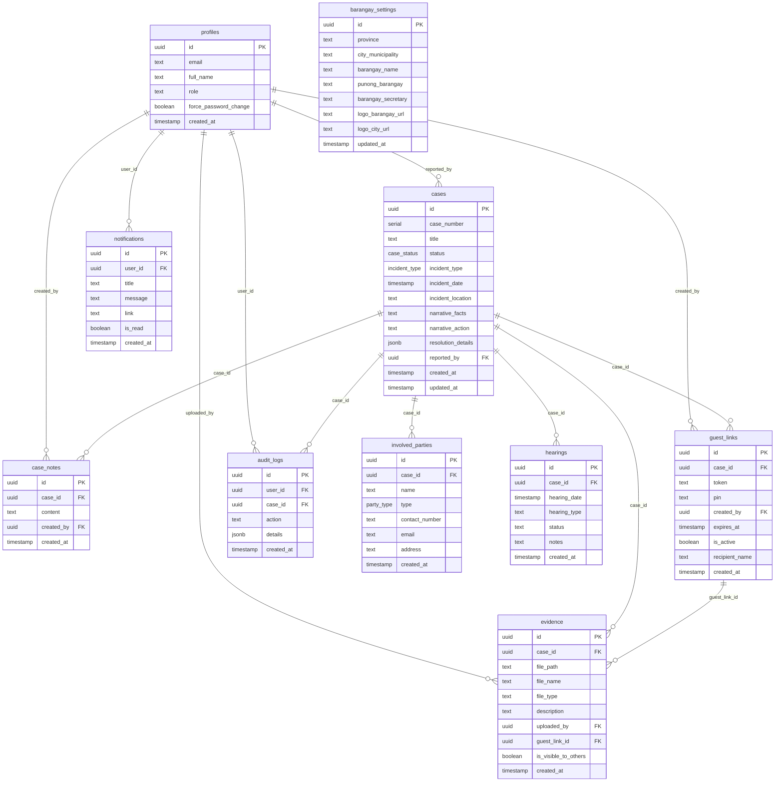
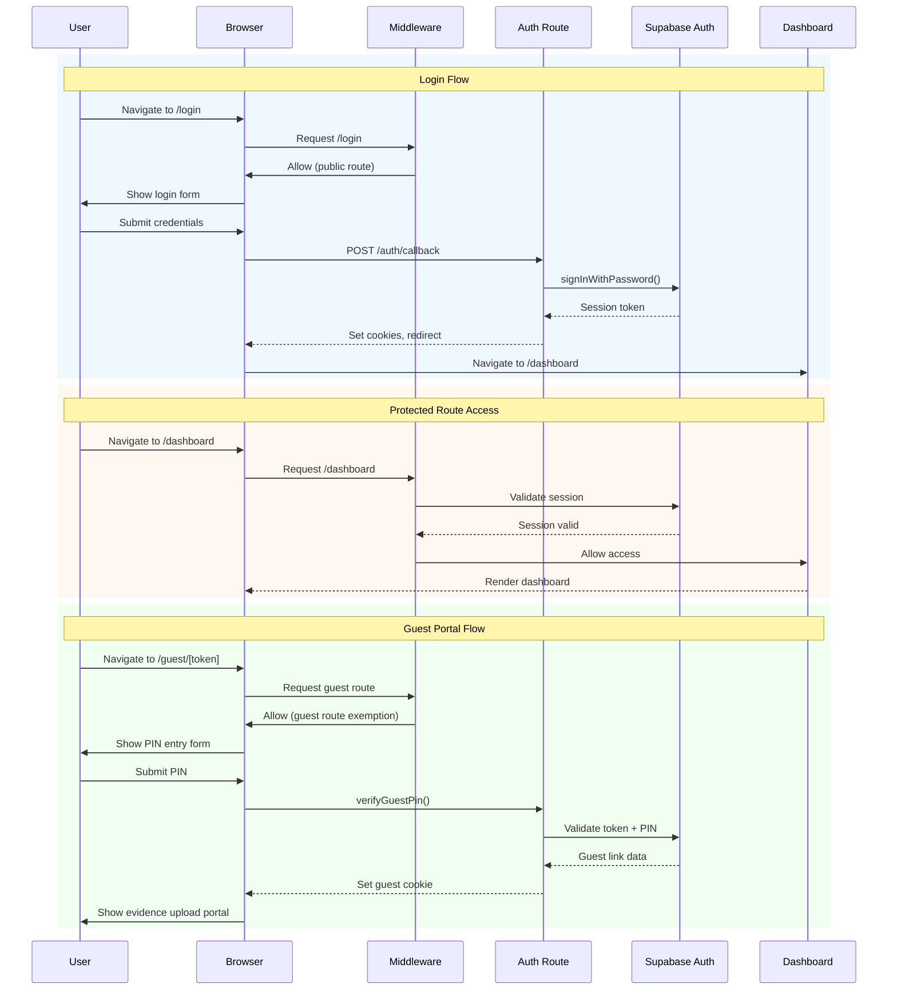
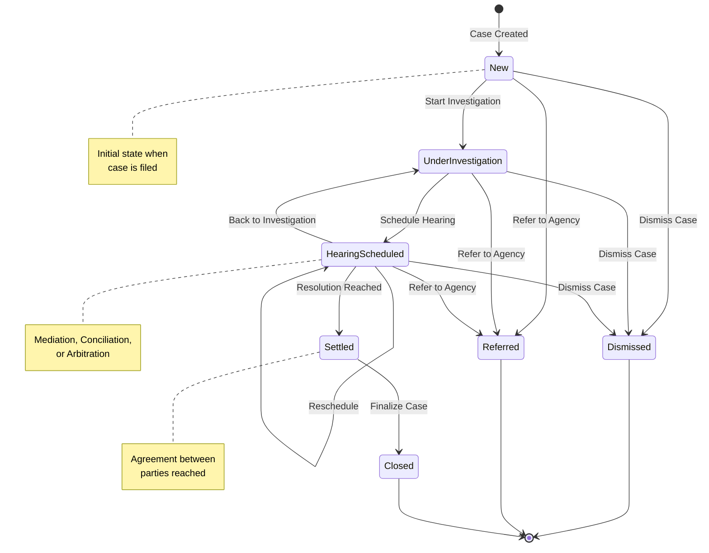
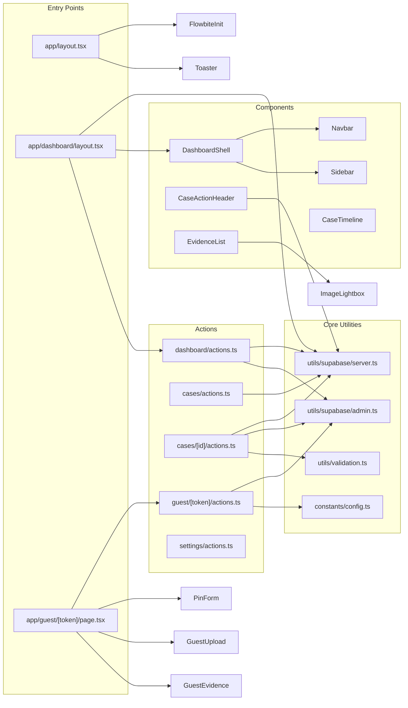
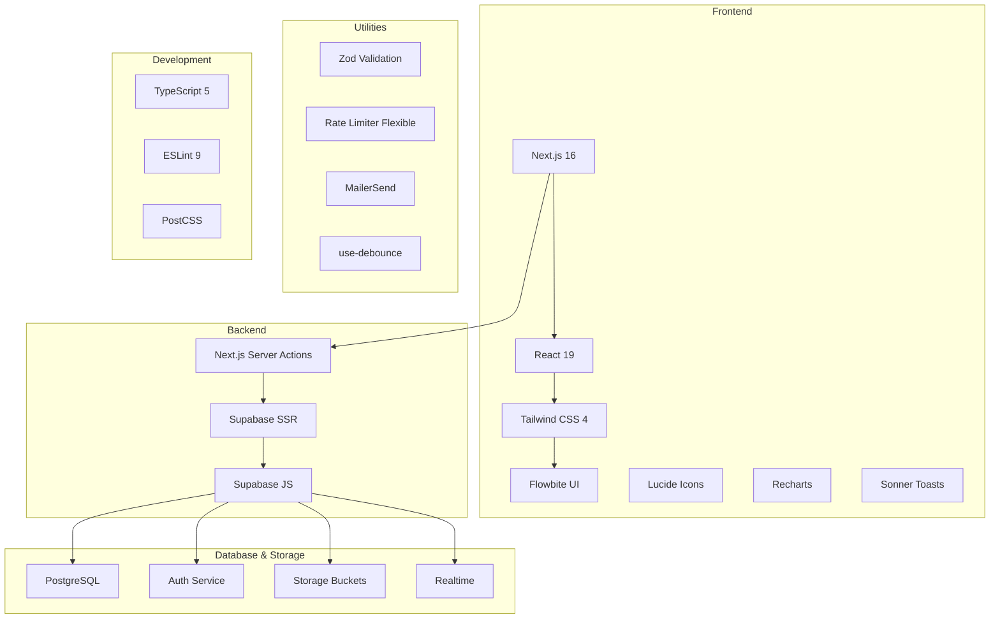

# System Architecture & Codebase Visualization

This document provides a comprehensive visualization of the BlotterSys codebase structure, dependencies, and data flow connections.

---

## 1. High-Level System Architecture

---

## 2. Directory Structure Overview

---

## 3. Component Dependency Graph

```mermaid
graph TD
    subgraph "Layout Components"
        RootLayout["app/layout.tsx"]
        DashboardLayout["app/dashboard/layout.tsx"]
        DashboardShell["DashboardShell.tsx"]
    end

    subgraph "Dashboard Shell Dependencies"
        DashboardShell --> Navbar["Navbar.tsx"]
        DashboardShell --> Sidebar["Sidebar.tsx"]
        Sidebar --> SidebarLink["sidebar/SidebarLink.tsx"]
        Sidebar --> SidebarSection["sidebar/SidebarSection.tsx"]
    end

    subgraph "Case Components"
        CaseDetailPage["Case Detail Page"]
        CaseDetailPage --> CaseActionHeader["CaseActionHeader.tsx"]
        CaseDetailPage --> CaseTimeline["CaseTimeline.tsx"]
        CaseDetailPage --> ProceedingsTracker["ProceedingsTracker.tsx"]
        CaseDetailPage --> DashboardEvidenceList["DashboardEvidenceList.tsx"]
        CaseDetailPage --> DashboardEvidenceUploadForm["DashboardEvidenceUploadForm.tsx"]
        CaseDetailPage --> ResolutionBanner["ResolutionBanner.tsx"]
        CaseDetailPage --> StatusStepper["StatusStepper.tsx"]
    end

    subgraph "Document Generation"
        CaseActionHeader --> DocumentPreviewModal["DocumentPreviewModal.tsx"]
        DocumentPreviewModal --> PrintableDocument["PrintableDocument.tsx"]
        DocumentPreviewModal --> PrintButton["PrintButton.tsx"]
        PrintableDocument --> DocTemplates["documents/*.tsx"]
    end

    subgraph "Shared UI Components"
        SearchInput["SearchInput.tsx"]
        FilterDropdown["FilterDropdown.tsx"]
        DateRangePicker["DateRangePicker.tsx"]
        PaginationControls["PaginationControls.tsx"]
        SortableColumn["SortableColumn.tsx"]
        SubmitButton["SubmitButton.tsx"]
        CopyButton["CopyButton.tsx"]
    end

    subgraph "Realtime Components"
        RealtimeNotifications["RealtimeNotifications.tsx"]
        RealtimeListener["RealtimeListener.tsx"]
        NotificationBell["NotificationBell.tsx"]
    end

    RootLayout --> FlowbiteInit["FlowbiteInit.tsx"]
    DashboardLayout --> DashboardShell
    DashboardLayout --> RealtimeNotifications

    CasesList["Cases List Page"] --> SearchInput
    CasesList --> FilterDropdown
    CasesList --> DateRangePicker
    CasesList --> PaginationControls
    CasesList --> SortableColumn
```

---

## 4. Data Flow Architecture

---

## 5. Database Entity Relationship

---

## 6. Authentication & Authorization Flow

---

## 7. Case Lifecycle State Machine

---

## 8. File Import Dependency Map

---

## 9. API Routes & Server Actions Summary

| Category            | File                                  | Key Functions                                                                        |
| ------------------- | ------------------------------------- | ------------------------------------------------------------------------------------ |
| **Dashboard**       | `app/dashboard/actions.ts`            | `getCachedProfile`, `getCachedNewCasesCount`, `getActionRequiredCases`               |
| **Cases**           | `app/dashboard/cases/actions.ts`      | `searchCases`, `exportCasesToCSV`                                                    |
| **Case Detail**     | `app/dashboard/cases/[id]/actions.ts` | `updateCaseStatus`, `addNote`, `uploadEvidence`, `deleteEvidence`, `createGuestLink` |
| **Case Workflow**   | `app/dashboard/cases/workflow.ts`     | `resolveCase`, `dismissCase`, `referCase`                                            |
| **Guest Portal**    | `app/guest/[token]/actions.ts`        | `verifyGuestPin`, `uploadGuestEvidence`, `deleteGuestEvidence`                       |
| **Settings**        | `app/dashboard/settings/actions.ts`   | `updateBarangaySettings`, `uploadLogo`                                               |
| **Admin**           | `app/dashboard/admin/actions.ts`      | `createUser`, `updateUser`, `deleteUser`                                             |
| **Auth**            | `app/auth/callback/route.ts`          | OAuth callback handler                                                               |
| **Password**        | `app/change-password/actions.ts`      | `changePassword`                                                                     |
| **Forgot Password** | `app/forgot-password/actions.ts`      | `forgotPassword`                                                                     |

---

## 10. Technology Stack Visualization

---

## Quick Reference: Key File Locations

| Purpose               | Location                   |
| --------------------- | -------------------------- |
| **Root Layout**       | `app/layout.tsx`           |
| **Dashboard Layout**  | `app/dashboard/layout.tsx` |
| **Case Management**   | `app/dashboard/cases/`     |
| **Guest Portal**      | `app/guest/[token]/`       |
| **Supabase Clients**  | `utils/supabase/`          |
| **Type Definitions**  | `types/index.ts`           |
| **Configuration**     | `constants/config.ts`      |
| **Database Schema**   | `supabase/schema.sql`      |
| **Shared Components** | `components/`              |
| **Custom Hooks**      | `hooks/`                   |
| **Image Utils**       | `lib/imageCompression.ts`  |
| **Validation**        | `utils/validation.ts`      |

---

> **Note:** These diagrams are created with Mermaid.js for easy version control and documentation updates. To view them properly, use a Markdown viewer that supports Mermaid diagrams (GitHub, VS Code with extension, etc.).
