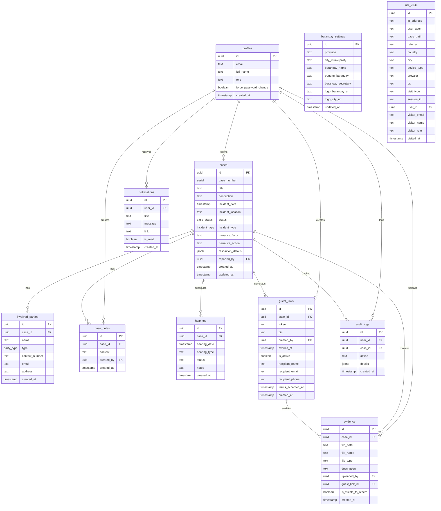

# ⚖️ BlotterSys - Modern Barangay Incident Management


**BlotterSys** is a next-generation web application designed to digitize and streamline the justice system at the Barangay level. It replaces traditional logbooks with a secure, cloud-based platform for managing incident reports, generating legal documents, and tracking case resolutions.

## ✨ Key Features

### 📂 Smart Case Management

- **Digital Blotter**: Record and track incidents with a structured workflow (Filed -> Hearing -> Amicable Settlement -> Certificate to File Action).
- **Real-time Updates**: Live status tracking for complainants and respondents.
- **Search & Filter**: Instantly retrieve cases by case number, name, or date.

### 🖨️ Automated Document Generation

- **One-Click Printing**: Generate official DILG-compliant forms instantly:
  - _Summons_
  - _Notice of Hearing_
  - _Amicable Settlement_
  - _Certificate to File Action_
- **PDF Export**: Download documents for offline archiving.

### 🔐 Secure Evidence Vault

- **Magic Links**: Send time-limited, secure upload links to residents via email.
- **Guest Uploads**: Residents can upload photos/videos without creating an account.
- **Bank-Grade Security**: All evidence is encrypted and stored securely via Supabase Storage.

### 📊 Analytics Dashboard

- **Insightful Metrics**: Track case volume, resolution rates, and common incident types.
- **Visual Reports**: Interactive charts powered by Recharts.

## 🛠️ Technology Stack

- **Framework**: [Next.js 16](https://nextjs.org/) (App Router)
- **Language**: [TypeScript](https://www.typescriptlang.org/)
- **Styling**: [Tailwind CSS 4](https://tailwindcss.com/)
- **Database & Auth**: [Supabase](https://supabase.com/)
- **Email Service**: [MailerSend](https://www.mailersend.com/)
- **UI Components**: [Flowbite](https://flowbite.com/) & [Lucide React](https://lucide.dev/)
- **Validation**: [Zod](https://zod.dev/)

## 🗄️ Database Schema

BlotterSys uses a PostgreSQL database hosted on Supabase with 11 interconnected tables that handle case management, user authentication, evidence storage, and system configuration. The schema is designed with Row Level Security (RLS) policies to ensure data privacy and role-based access control.

### Entity Relationship Diagram



### Key Enumerations

| Enum Type          | Allowed Values                                                                                          | Usage                            |
| ------------------ | ------------------------------------------------------------------------------------------------------- | -------------------------------- |
| **case_status**    | `New`, `Under Investigation`, `Hearing Scheduled`, `Settled`, `Closed`, `Dismissed`, `Referred`         | Tracks case lifecycle status     |
| **party_type**     | `Complainant`, `Respondent`, `Witness`                                                                  | Defines role of involved parties |
| **incident_type**  | `Theft`, `Harassment`, `Vandalism`, `Physical Injury`, `Property Damage`, `Public Disturbance`, `Other` | Categorizes incident types       |
| **hearing_type**   | `Mediation`, `Conciliation`, `Arbitration`                                                              | Defines hearing format           |
| **hearing_status** | `Scheduled`, `Completed`, `No Show`, `Rescheduled`, `Settled`                                           | Tracks hearing outcome           |

### Storage Buckets

| Bucket       | Access  | Purpose             | RLS Policies                           |
| ------------ | ------- | ------------------- | -------------------------------------- |
| **branding** | Public  | Barangay/City logos | ✅ Authenticated upload, Public read   |
| **evidence** | Private | Case evidence files | ✅ Authenticated only, Guest via token |

### Security Features

- **Row Level Security (RLS)**: All tables have RLS enabled with role-based policies
- **Cascade Deletion**: Deleting a case automatically removes related parties, notes, evidence, and hearings
- **Audit Triggers**: Case status changes auto-log to `audit_logs`
- **Guest Link Auto-Expiry**: Links automatically deactivate when case status becomes terminal (`Settled`, `Closed`, `Dismissed`, `Referred`)

> 💡 **For Developers**: Full schema with indexes, functions, and triggers available in [`supabase/schema.sql`](file:///c:/Users/kuyag/OneDrive/Desktop/Final/Final/supabase/schema.sql)

## 🚀 Getting Started

### Prerequisites

- Node.js 18+
- npm or yarn
- A Supabase project
- A MailerSend account (for email notifications)

### Installation

1.  **Clone the repository**

    ```bash
    git clone https://github.com/yourusername/blottersys.git
    cd blottersys
    ```

2.  **Install dependencies**

    ```bash
    npm install
    ```

3.  **Environment Setup**
    Create a `.env.local` file in the root directory and add the following keys:

    ```env
    # Supabase Configuration
    NEXT_PUBLIC_SUPABASE_URL=your_supabase_project_url
    NEXT_PUBLIC_SUPABASE_ANON_KEY=your_supabase_anon_key

    # MailerSend Configuration (for Guest Links)
    MAILERSEND_API_KEY=your_mailersend_api_key
    MAILERSEND_FROM_EMAIL=noreply@yourdomain.com
    MAILERSEND_FROM_NAME="BlotterSys Notification"
    ```

4.  **Run the development server**

    ```bash
    npm run dev
    ```

5.  **Access the Application**
    Open [http://localhost:3000](http://localhost:3000) in your browser.

## 📂 Project Structure

```
├── app/                # Next.js App Router pages and API routes
│   ├── api/            # Backend API endpoints
│   ├── dashboard/      # Protected dashboard views
│   └── guest/          # Public-facing guest upload pages
├── components/         # Reusable UI components
├── lib/                # Library configurations (Supabase, Utils)
├── supabase/           # Database schema and migrations
├── types/              # TypeScript type definitions
└── utils/              # Helper functions
```

## 🔒 Security & Privacy

- **Row Level Security (RLS)**: Strictly enforces data access policies at the database level.
- **Audit Logging**: Every action (create, update, delete) is logged for accountability.
- **Data Encryption**: Sensitive data is encrypted in transit and at rest.

## 📊 Use Case Diagram & System Flowchart

This section provides a visual overview of how different users interact with BlotterSys and how the system processes cases from start to finish.

---

### 👥 System Actors

BlotterSys has three main types of users, each with specific roles and permissions:

#### 1. **Admin** (Barangay Captain/Secretary)

- **Access Level**: Full system control
- **Key Responsibilities**:
  - Configure barangay settings (logos, official names)
  - Manage user accounts (create staff, assign roles)
  - View audit logs and security reports
  - Access all features available to Staff
- **Unique Capabilities**:
  - System settings configuration
  - Audit log access
  - Site visit analytics
  - User role management

#### 2. **Staff** (Desk Officer/Kagawad)

- **Access Level**: Operational access
- **Key Responsibilities**:
  - File and manage blotter cases
  - Generate legal documents (Summons, CFA, etc.)
  - Create guest links for evidence collection
  - Update case status and add notes
- **Restrictions**:
  - Cannot access system settings
  - Cannot view audit logs
  - Cannot manage user accounts

#### 3. **Guest** (Resident/Complainant/Respondent)

- **Access Level**: Limited, link-based
- **Key Responsibilities**:
  - Upload evidence (photos) for assigned case
  - View case narrative and hearing schedule
- **Access Method**:
  - Receives email with magic link + 6-digit PIN
  - No account creation required
  - Time-limited access (24-72 hours)

---

### 🎯 Use Case Diagram

The following diagram shows all possible interactions between actors and the system:

```mermaid
graph TB
    subgraph Actors
        Admin[👤 Admin<br/>Barangay Captain]
        Staff[👤 Staff<br/>Desk Officer]
        Guest[👤 Guest<br/>Resident]
    end

    subgraph "Core Features"
        Login[🔐 Login to Dashboard]
        CreateCase[📝 File New Case]
        UpdateCase[🔄 Update Case Status]
        GenerateDocs[📄 Generate Documents]
        ViewAnalytics[📊 View Analytics]
        ManageEvidence[📎 Manage Evidence]
        CreateGuestLink[🔗 Create Guest Link]
        UploadEvidence[📤 Upload Evidence]
        SystemSettings[⚙️ System Settings]
        AuditLogs[📋 View Audit Logs]
        UserManagement[👥 Manage Users]
    end

    Admin --> Login
    Admin --> CreateCase
    Admin --> UpdateCase
    Admin --> GenerateDocs
    Admin --> ViewAnalytics
    Admin --> ManageEvidence
    Admin --> CreateGuestLink
    Admin --> SystemSettings
    Admin --> AuditLogs
    Admin --> UserManagement

    Staff --> Login
    Staff --> CreateCase
    Staff --> UpdateCase
    Staff --> GenerateDocs
    Staff --> ViewAnalytics
    Staff --> ManageEvidence
    Staff --> CreateGuestLink

    Guest --> UploadEvidence
    Guest -.->|Views| CreateCase

    style Admin fill:#e1f5ff
    style Staff fill:#fff4e1
    style Guest fill:#f0f0f0
    style SystemSettings fill:#ffcccc
    style AuditLogs fill:#ffcccc
    style UserManagement fill:#ffcccc
```



**Legend**:

- **Solid lines** = User can perform action
- **Dashed lines** = User can view only (read-only)
- **Red boxes** = Admin-only features

---

### 🔄 System Flowchart

The BlotterSys workflow is organized into modular subprocesses for clarity. The main overview shows high-level system flow, with detailed subprocesses below for each major operation.

---

#### 📋 Main System Overview

This diagram shows the entry points and main process routing:

```mermaid
flowchart TD
    Start([🚀 START]) --> UserType{User Type?}

    UserType -->|Admin/Staff| AuthFlow[🔐 Authentication Process]
    UserType -->|Guest| GuestFlow[📧 Guest Access Process]

    AuthFlow --> Dashboard[📊 Dashboard]
    Dashboard --> Menu{Select Action}

    Menu -->|File Case| CaseFilingFlow[📝 Case Filing Process]
    Menu -->|Manage Case| CaseManageFlow[🔄 Case Management Process]
    Menu -->|Generate Docs| DocGenFlow[📄 Document Generation Process]
    Menu -->|Create Guest Link| GuestLinkFlow[🔗 Guest Link Creation Process]
    Menu -->|View Analytics| AnalyticsFlow[📊 Analytics Process]

    CaseFilingFlow --> End([✅ END])
    CaseManageFlow --> End
    DocGenFlow --> End
    GuestLinkFlow --> End
    AnalyticsFlow --> End
    GuestFlow --> End

    style Start fill:#4CAF50,color:#fff
    style End fill:#2196F3,color:#fff
    style AuthFlow fill:#e3f2fd
    style GuestFlow fill:#fff3e0
    style CaseFilingFlow fill:#e8f5e9
    style CaseManageFlow fill:#e8f5e9
    style DocGenFlow fill:#f3e5f5
    style GuestLinkFlow fill:#fff3e0
    style AnalyticsFlow fill:#fce4ec
```



---

#### 🔐 Subprocess 1: Authentication Process

Staff and Admin login workflow with security controls:

```mermaid
flowchart TD
    AuthStart([Start: Login]) --> EnterCreds[Enter Email & Password]
    EnterCreds --> Validate{Credentials Valid?}

    Validate -->|No| CheckAttempts{Login Attempts ≥ 5?}
    CheckAttempts -->|Yes| LockAccount[🔒 Lock Account<br/>15 minutes]
    CheckAttempts -->|No| EnterCreds
    LockAccount --> AuthEnd([End: Locked])

    Validate -->|Yes| LoadProfile[Load User Profile]
    LoadProfile --> CheckRole{Role?}

    CheckRole -->|Admin| AdminDash[📊 Admin Dashboard<br/>All Features]
    CheckRole -->|Staff| StaffDash[📊 Staff Dashboard<br/>Operational Features]

    AdminDash --> AuthEnd([End: Authenticated])
    StaffDash --> AuthEnd

    style AuthStart fill:#4CAF50,color:#fff
    style AuthEnd fill:#2196F3,color:#fff
    style LockAccount fill:#ff6b6b,color:#fff
    style Validate fill:#ffd93d
```



---

#### 📝 Subprocess 2: Case Filing Process

Creating a new case with automatic notifications:

```mermaid
flowchart TD
    FileStart([Start: File Case]) --> OpenForm[Open Case Form]
    OpenForm --> EnterParties[Enter Complainant &<br/>Respondent Details]
    EnterParties --> EnterIncident[Select Incident Type &<br/>Date/Location]
    EnterIncident --> WriteNarrative[Write Narrative<br/>Facts & Action Taken]
    WriteNarrative --> ValidateForm{Form Complete?}

    ValidateForm -->|No| ShowErrors[Display Validation Errors]
    ShowErrors --> OpenForm

    ValidateForm -->|Yes| SaveCase[💾 Save Case<br/>Status: New<br/>Generate Case Number]
    SaveCase --> CheckPriority{High Priority<br/>Incident?}

    CheckPriority -->|Yes: Theft,<br/>Physical Injury,<br/>Harassment| NotifyAdmins[📧 Email All Admins<br/>Urgent Case Alert]
    CheckPriority -->|No| SkipNotify[No Notification]

    NotifyAdmins --> LogAudit[📋 Log to Audit Logs]
    SkipNotify --> LogAudit
    LogAudit --> FileEnd([End: Case Created])

    style FileStart fill:#4CAF50,color:#fff
    style FileEnd fill:#2196F3,color:#fff
    style CheckPriority fill:#ffd93d
    style NotifyAdmins fill:#ffccbc
```



---

#### 🔄 Subprocess 3: Case Management Process

Updating case status, adding notes, and handling terminal states:

```mermaid
flowchart TD
    ManageStart([Start: Manage Case]) --> SearchCase[🔍 Search & Select Case]
    SearchCase --> ViewDetails[View Case Details]
    ViewDetails --> SelectAction{Select Action}

    SelectAction -->|Update Status| ChangeStatus[Change Status:<br/>New → Investigation<br/>→ Hearing → Resolution]
    SelectAction -->|Add Note| WriteNote[💬 Write Internal Note]
    SelectAction -->|View History| ShowHistory[📜 Display Audit Trail]

    ChangeStatus --> CheckTerminal{Terminal Status?}
    CheckTerminal -->|Yes: Settled,<br/>Closed, Dismissed,<br/>Referred| LockCase[🔒 Lock Case<br/>Read-Only Mode]
    CheckTerminal -->|No| SaveStatus[💾 Save Status Update]

    LockCase --> DeactivateLinks[⛔ Deactivate All<br/>Guest Links for Case]
    DeactivateLinks --> LogChange[📋 Log Status Change]
    SaveStatus --> LogChange

    WriteNote --> SaveNote[💾 Save Note]
    SaveNote --> LogChange

    ShowHistory --> ManageEnd([End: Return to Dashboard])
    LogChange --> ManageEnd

    style ManageStart fill:#4CAF50,color:#fff
    style ManageEnd fill:#2196F3,color:#fff
    style LockCase fill:#ff6b6b,color:#fff
    style DeactivateLinks fill:#ff6b6b,color:#fff
    style CheckTerminal fill:#ffd93d
```



---

#### 📄 Subprocess 4: Document Generation Process

Generating DILG-compliant PDF documents:

```mermaid
flowchart TD
    DocStart([Start: Generate Document]) --> SelectCase[Select Case]
    SelectCase --> SelectType{Document Type?}

    SelectType -->|Summons| LoadSummons[Load Summons Template]
    SelectType -->|Notice of Hearing| LoadNotice[Load Notice Template]
    SelectType -->|Amicable Settlement| LoadSettlement[Load Settlement Template]
    SelectType -->|Certificate to<br/>File Action| LoadCFA[Load CFA Template]

    LoadSummons --> FillData[Fill Case Data<br/>Parties, Incident, Dates]
    LoadNotice --> FillData
    LoadSettlement --> FillData
    LoadCFA --> FillData

    FillData --> GeneratePDF[🖨️ Generate PDF<br/>with Puppeteer]
    GeneratePDF --> DownloadPDF[⬇️ Download PDF]
    DownloadPDF --> LogGeneration[📋 Log Document<br/>Generation]
    LogGeneration --> DocEnd([End: Document Ready])

    style DocStart fill:#4CAF50,color:#fff
    style DocEnd fill:#2196F3,color:#fff
    style SelectType fill:#ffd93d
```



---

#### 🔗 Subprocess 5: Guest Link Creation Process

Creating secure magic links for evidence upload:

```mermaid
flowchart TD
    LinkStart([Start: Create Link]) --> SelectCase[Select Case]
    SelectCase --> EnterGuest[Enter Guest Details:<br/>Name, Email, Phone]
    EnterGuest --> SetDuration[Set Link Duration<br/>1-168 hours, default 24h]
    SetDuration --> Generate[Generate:<br/>✓ Unique Token UUID<br/>✓ 6-Digit PIN 100000-999999]
    Generate --> SaveLink[💾 Save Guest Link<br/>Status: Active]
    SaveLink --> ComposeEmail[Compose Email:<br/>Magic Link URL<br/>PIN Code<br/>Case Details<br/>Expiration Time]
    ComposeEmail --> SendEmail[📧 Send via MailerSend]
    SendEmail --> CheckSent{Email Sent?}

    CheckSent -->|Yes| LogSuccess[📋 Log Link Creation]
    CheckSent -->|No| ShowError[❌ Display Error<br/>Check Email/API]

    LogSuccess --> LinkEnd([End: Link Active])
    ShowError --> LinkEnd

    style LinkStart fill:#4CAF50,color:#fff
    style LinkEnd fill:#2196F3,color:#fff
    style CheckSent fill:#ffd93d
```



---

#### 📤 Subprocess 6: Guest Evidence Upload Process

Guest access and file upload workflow with security validation:

```mermaid
flowchart TD
    GuestStart([Start: Guest Access]) --> ReceiveEmail[📧 Receive Email<br/>with Link & PIN]
    ReceiveEmail --> ClickLink[🖱️ Click Magic Link]
    ClickLink --> EnterPIN[🔢 Enter 6-Digit PIN]
    EnterPIN --> ValidatePIN{PIN Correct?}

    ValidatePIN -->|No| CheckPINAttempts{PIN Attempts ≥ 3?}
    CheckPINAttempts -->|Yes| LockPIN[🔒 Lock for 10 minutes]
    CheckPINAttempts -->|No| EnterPIN
    LockPIN --> GuestEnd([End: Access Denied])

    ValidatePIN -->|Yes| CheckExpiry{Link Expired?}
    CheckExpiry -->|Yes| ShowExpired[❌ Link Expired Message]
    ShowExpired --> GuestEnd

    CheckExpiry -->|No| LoadPortal[🏠 Load Guest Portal]
    LoadPortal --> ShowCase[View:<br/>✓ Case Narrative<br/>✓ Hearing Schedule<br/>✓ Existing Evidence]
    ShowCase --> UserAction{Action?}

    UserAction -->|Upload| SelectFile[📁 Select Photo<br/>JPEG/PNG/WebP]
    UserAction -->|Exit| GuestEnd

    SelectFile --> ValidateFile{Valid File?<br/>Size ≤ 5MB<br/>Count ≤ 5}
    ValidateFile -->|No| FileError[❌ File Rejected<br/>Show Error]
    FileError --> ShowCase

    ValidateFile -->|Yes| UploadStorage[☁️ Upload to<br/>Supabase Storage<br/>evidence/ bucket]
    UploadStorage --> LinkToCase[🔗 Create Evidence<br/>Record in Database]
    LinkToCase --> UploadSuccess[✅ Evidence Saved]
    UploadSuccess --> ShowCase

    style GuestStart fill:#4CAF50,color:#fff
    style GuestEnd fill:#2196F3,color:#fff
    style LockPIN fill:#ff6b6b,color:#fff
    style ValidatePIN fill:#ffd93d
    style CheckExpiry fill:#ffd93d
    style ValidateFile fill:#ffd93d
```



---

#### 📊 Subprocess 7: Analytics Dashboard Process

Viewing system metrics and reports:

```mermaid
flowchart TD
    AnalyticsStart([Start: View Analytics]) --> OpenDashboard[Open Analytics Page]
    OpenDashboard --> ShowFilters[Display Filters:<br/>Date Range, Status,<br/>Incident Type]
    ShowFilters --> ApplyFilters[User Selects Filters]
    ApplyFilters --> FetchData[📡 Call RPC:<br/>get_analytics_charts_dynamic]
    FetchData --> ProcessData[Process Data:<br/>✓ Status Distribution<br/>✓ Incident Types<br/>✓ Monthly Trends]
    ProcessData --> RenderCharts[📈 Render Charts<br/>with Recharts]
    RenderCharts --> DisplayMetrics[Show Metrics:<br/>Total Cases<br/>Active vs Resolved<br/>Comparison with<br/>Previous Period]
    DisplayMetrics --> UserAction{User Action?}

    UserAction -->|Change Filter| ApplyFilters
    UserAction -->|Export| ExportData[⬇️ Export to CSV]
    UserAction -->|Exit| AnalyticsEnd([End: Return to Dashboard])

    ExportData --> AnalyticsEnd

    style AnalyticsStart fill:#4CAF50,color:#fff
    style AnalyticsEnd fill:#2196F3,color:#fff
    style UserAction fill:#ffd93d
```



---

### 📋 Step-by-Step Flow Explanations

#### **Flow 1: Admin/Staff Files a New Case**

1. **Login** → Admin/Staff enters email and password
2. **Authentication** → System validates credentials (5 attempts allowed per 15 minutes)
3. **Dashboard** → User lands on the main dashboard
4. **File New Case** → Click "New Case" button
5. **Enter Details** → Fill out form:
   - Complainant and Respondent information
   - Incident type (Theft, Harassment, etc.)
   - Incident date and location
   - Narrative description
6. **Save** → Case is created with status "New"
7. **Auto-Notification** → If incident type is Theft, Physical Injury, or Harassment, system auto-emails all admins
8. **Case Created** → User can now manage the case

#### **Flow 2: Staff Generates Legal Documents**

1. **Search Case** → Find case by case number or name
2. **View Case Details** → Open case detail page
3. **Select Document** → Choose document type:
   - **Summons** - Initial notification to respondent
   - **Notice of Hearing** - Hearing schedule notification
   - **Amicable Settlement** - Settlement agreement
   - **Certificate to File Action** - Court referral
4. **Generate PDF** → System uses Puppeteer to create PDF with case data
5. **Download** → PDF is downloaded to user's device

#### **Flow 3: Admin Creates Guest Link for Evidence Collection**

1. **Open Case** → Navigate to specific case
2. **Click "Create Guest Link"** → Open guest link form
3. **Enter Guest Details**:
   - Guest name
   - Email address
   - Link duration (1-168 hours, default 24h)
4. **System Generates**:
   - Unique token (UUID)
   - Random 6-digit PIN (100000-999999)
5. **Email Sent** → MailerSend delivers email with:
   - Magic link URL
   - 6-digit PIN
   - Case details
   - Expiration time
6. **Link Active** → Guest can now access upload portal

#### **Flow 4: Guest Uploads Evidence**

1. **Receive Email** → Guest gets email notification
2. **Click Link** → Opens guest upload portal
3. **Enter PIN** → Guest enters 6-digit PIN (3 attempts allowed)
4. **PIN Validation** → System verifies PIN via cookie
5. **Check Expiration** → System verifies link hasn't expired
6. **Access Granted** → Guest sees:
   - Case narrative (incident description)
   - Next hearing date (if scheduled)
   - Existing evidence (own + staff uploads)
7. **Select Photo** → Guest chooses image file
8. **Validation** → System checks:
   - File type (JPEG, PNG, WebP only)
   - File size (≤ 5MB)
   - Photo count (max 5 per link)
9. **Upload** → File is uploaded to Supabase `evidence` bucket
10. **Link to Case** → Evidence is associated with case ID
11. **Success** → File appears in evidence list

#### **Flow 5: Admin Updates Case Status to Terminal State**

1. **Open Case** → Select case to close
2. **Update Status** → Change status to:
   - **Settled** - Parties reached agreement
   - **Closed** - Case administratively closed
   - **Dismissed** - Case dismissed
   - **Referred** - Escalated to court
3. **Confirmation** → Admin confirms status change
4. **Case Locked** → Case becomes read-only (no edits allowed)
5. **Guest Links Deactivated** → All active guest links for this case are automatically disabled
6. **Audit Logged** → Status change is recorded in audit_logs table

#### **Flow 6: Staff Views Analytics Dashboard**

1. **Navigate to Dashboard** → Click "Analytics" in sidebar
2. **Select Filters**:
   - Date range (7d, 30d, This Month, Custom, etc.)
   - Incident type filter
   - Status filter
3. **Fetch Data** → System calls `get_analytics_charts_dynamic()` RPC
4. **Display Charts**:
   - **Status Distribution** - Pie chart of case statuses
   - **Incident Types** - Bar chart of incident categories
   - **Monthly Trends** - Line chart of case volume over time
5. **View Metrics**:
   - Total cases
   - Active cases
   - Resolved cases
   - Comparison with previous period

---

### 🔐 Security Checkpoints

Throughout the system, these security measures are enforced:

| Checkpoint                   | Description                         | Enforcement             |
| ---------------------------- | ----------------------------------- | ----------------------- |
| **Login Rate Limiting**      | Max 5 login attempts per 15 minutes | `rate-limiter-flexible` |
| **PIN Rate Limiting**        | Max 3 PIN attempts per 10 minutes   | `rate-limiter-flexible` |
| **Row Level Security (RLS)** | Database-level access control       | Supabase RLS policies   |
| **Session Validation**       | Verify user session on each request | Supabase Auth           |
| **Guest Link Expiration**    | Auto-expire links after duration    | Database trigger        |
| **Case Lock**                | Prevent edits to terminal cases     | Application logic       |
| **Audit Logging**            | Log all critical actions            | Database trigger        |

---

### 🎬 Common User Journeys

#### **Journey A: Complainant Reports Noise Dispute**

1. **Complainant visits Barangay Hall** → Speaks with Desk Officer (Staff)
2. **Staff logs into BlotterSys** → Opens dashboard
3. **Staff files new case**:
   - Incident Type: Public Disturbance
   - Complainant: Juan dela Cruz
   - Respondent: Pedro Santos
   - Narrative: "Loud karaoke at 2 AM"
4. **System creates Case #00123** → Status: New
5. **Staff schedules hearing** → Adds hearing entry for next week
6. **Staff generates Summons** → Downloads PDF, prints for respondent
7. **Staff creates guest link** → Sends to complainant for photo evidence
8. **Complainant uploads photos** → Via magic link (valid for 24 hours)
9. **Hearing occurs** → Parties reach agreement
10. **Staff updates status to "Settled"** → Generates Amicable Settlement document
11. **Case locked** → Guest link auto-deactivates

#### **Journey B: Admin Reviews System Analytics**

1. **Admin logs in** → Views dashboard
2. **Clicks "Analytics"** → Opens analytics page
3. **Selects "This Month" filter** → Views current month data
4. **Reviews metrics**:
   - 45 total cases this month
   - 30 active, 15 resolved
   - Most common: Property Damage (12 cases)
5. **Checks action items**:
   - 3 stale cases (>15 days without update)
   - 2 hearings scheduled this week
6. **Navigates to Audit Logs** → Reviews staff activity
7. **Verifies site visits** → Checks system usage analytics

---

## 📄 License

This project is proprietary software developed for Local Government Units. Unauthorized reproduction or distribution is strictly prohibited.

---

© 2025 BlotterSys™ Inc. All Rights Reserved.
