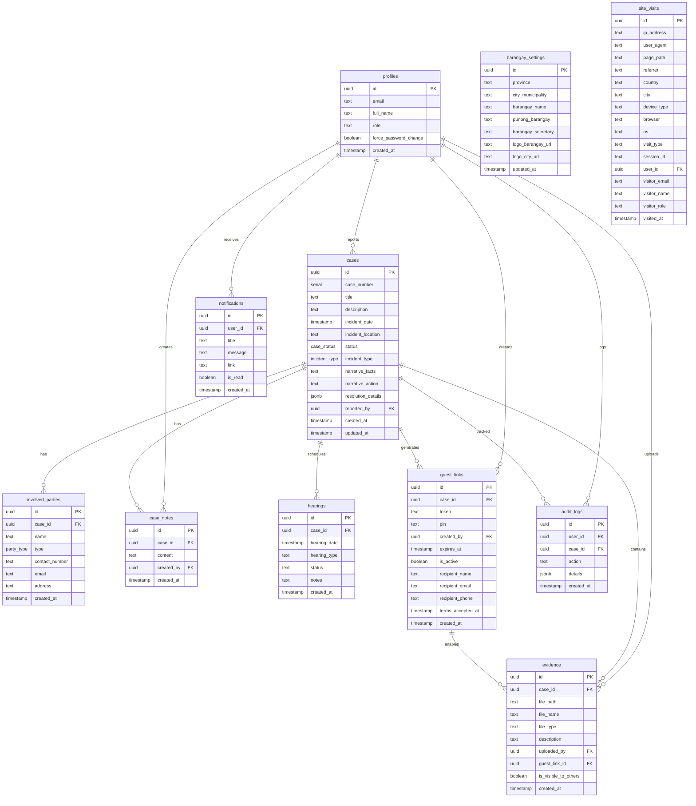

# ⚖️ BlotterSys - Modern Barangay Incident Management


**BlotterSys** is a next-generation web application designed to digitize and streamline the justice system at the Barangay level. It replaces traditional logbooks with a secure, cloud-based platform for managing incident reports, generating legal documents, and tracking case resolutions.

## ✨ Key Features

### 📂 Smart Case Management

- **Digital Blotter**: Record and track incidents with a structured workflow (Filed -> Hearing -> Amicable Settlement -> Certificate to File Action).
- **Real-time Updates**: Live status tracking for complainants and respondents.
- **Search & Filter**: Instantly retrieve cases by case number, name, or date.

### 🖨️ Automated Document Generation

- **One-Click Printing**: Generate official DILG-compliant forms instantly:
  - _Summons_
  - _Notice of Hearing_
  - _Amicable Settlement_
  - _Certificate to File Action_
- **PDF Export**: Download documents for offline archiving.

### 🔐 Secure Evidence Vault

- **Magic Links**: Send time-limited, secure upload links to residents via email.
- **Guest Uploads**: Residents can upload photos/videos without creating an account.
- **Bank-Grade Security**: All evidence is encrypted and stored securely via Supabase Storage.

### 📊 Analytics Dashboard

- **Insightful Metrics**: Track case volume, resolution rates, and common incident types.
- **Visual Reports**: Interactive charts powered by Recharts.

## 🛠️ Technology Stack

- **Framework**: [Next.js 16](https://nextjs.org/) (App Router)
- **Language**: [TypeScript](https://www.typescriptlang.org/)
- **Styling**: [Tailwind CSS 4](https://tailwindcss.com/)
- **Database & Auth**: [Supabase](https://supabase.com/)
- **Email Service**: [MailerSend](https://www.mailersend.com/)
- **UI Components**: [Flowbite](https://flowbite.com/) & [Lucide React](https://lucide.dev/)
- **Validation**: [Zod](https://zod.dev/)

💡 **For detailed technical information, architecture patterns, security measures, and deployment guides, see [Technical Background Documentation](./docs/TECHNICAL_BACKGROUND.md)**

## 🗄️ Database Schema

BlotterSys uses a PostgreSQL database hosted on Supabase with 11 interconnected tables that handle case management, user authentication, evidence storage, and system configuration. The schema is designed with Row Level Security (RLS) policies to ensure data privacy and role-based access control.

### Entity Relationship Diagram



### Key Enumerations

| Enum Type          | Allowed Values                                                                                          | Usage                            |
| ------------------ | ------------------------------------------------------------------------------------------------------- | -------------------------------- |
| **case_status**    | `New`, `Under Investigation`, `Hearing Scheduled`, `Settled`, `Closed`, `Dismissed`, `Referred`         | Tracks case lifecycle status     |
| **party_type**     | `Complainant`, `Respondent`, `Witness`                                                                  | Defines role of involved parties |
| **incident_type**  | `Theft`, `Harassment`, `Vandalism`, `Physical Injury`, `Property Damage`, `Public Disturbance`, `Other` | Categorizes incident types       |
| **hearing_type**   | `Mediation`, `Conciliation`, `Arbitration`                                                              | Defines hearing format           |
| **hearing_status** | `Scheduled`, `Completed`, `No Show`, `Rescheduled`, `Settled`                                           | Tracks hearing outcome           |

### Storage Buckets

| Bucket       | Access  | Purpose             | RLS Policies                           |
| ------------ | ------- | ------------------- | -------------------------------------- |
| **branding** | Public  | Barangay/City logos | ✅ Authenticated upload, Public read   |
| **evidence** | Private | Case evidence files | ✅ Authenticated only, Guest via token |

### Security Features

- **Row Level Security (RLS)**: All tables have RLS enabled with role-based policies
- **Cascade Deletion**: Deleting a case automatically removes related parties, notes, evidence, and hearings
- **Audit Triggers**: Case status changes auto-log to `audit_logs`
- **Guest Link Auto-Expiry**: Links automatically deactivate when case status becomes terminal (`Settled`, `Closed`, `Dismissed`, `Referred`)

> 💡 **For Developers**: Full schema with indexes, functions, and triggers available in [`supabase/schema.sql`](file:///c:/Users/kuyag/OneDrive/Desktop/Final/Final/supabase/schema.sql)

## 🚀 Getting Started

### Prerequisites

- Node.js 18+
- npm or yarn
- A Supabase project
- A MailerSend account (for email notifications)

### Installation

1.  **Clone the repository**

    ```bash
    git clone https://github.com/yourusername/blottersys.git
    cd blottersys
    ```

2.  **Install dependencies**

    ```bash
    npm install
    ```

3.  **Environment Setup**
    Create a `.env.local` file in the root directory and add the following keys:

    ```env
    # Supabase Configuration
    NEXT_PUBLIC_SUPABASE_URL=your_supabase_project_url
    NEXT_PUBLIC_SUPABASE_ANON_KEY=your_supabase_anon_key

    # MailerSend Configuration (for Guest Links)
    MAILERSEND_API_KEY=your_mailersend_api_key
    MAILERSEND_FROM_EMAIL=noreply@yourdomain.com
    MAILERSEND_FROM_NAME="BlotterSys Notification"
    ```

4.  **Run the development server**

    ```bash
    npm run dev
    ```

5.  **Access the Application**
    Open [http://localhost:3000](http://localhost:3000) in your browser.

## 📂 Project Structure

```
├── app/                # Next.js App Router pages and API routes
│   ├── api/            # Backend API endpoints
│   ├── dashboard/      # Protected dashboard views
│   └── guest/          # Public-facing guest upload pages
├── components/         # Reusable UI components
├── lib/                # Library configurations (Supabase, Utils)
├── supabase/           # Database schema and migrations
├── types/              # TypeScript type definitions
└── utils/              # Helper functions
```

## 🔒 Security & Privacy

- **Row Level Security (RLS)**: Strictly enforces data access policies at the database level.
- **Audit Logging**: Every action (create, update, delete) is logged for accountability.
- **Data Encryption**: Sensitive data is encrypted in transit and at rest.

## 📊 Use Case Diagram & System Flowchart

This section provides a visual overview of how different users interact with BlotterSys and how the system processes cases from start to finish.

---

### 👥 System Actors

BlotterSys has three main types of users, each with specific roles and permissions:

#### 1. **Admin** (Barangay Captain/Secretary)

- **Access Level**: Full system control
- **Key Responsibilities**:
  - Configure barangay settings (logos, official names)
  - Manage user accounts (create staff, assign roles)
  - View audit logs and security reports
  - Access all features available to Staff
- **Unique Capabilities**:
  - System settings configuration
  - Audit log access
  - Site visit analytics
  - User role management

#### 2. **Staff** (Desk Officer/Kagawad)

- **Access Level**: Operational access
- **Key Responsibilities**:
  - File and manage blotter cases
  - Generate legal documents (Summons, CFA, etc.)
  - Create guest links for evidence collection
  - Update case status and add notes
- **Restrictions**:
  - Cannot access system settings
  - Cannot view audit logs
  - Cannot manage user accounts

#### 3. **Guest** (Resident/Complainant/Respondent)

- **Access Level**: Limited, link-based
- **Key Responsibilities**:
  - Upload evidence (photos) for assigned case
  - View case narrative and hearing schedule
- **Access Method**:
  - Receives email with magic link + 6-digit PIN
  - No account creation required
  - Time-limited access (24-72 hours)

---

### 🎯 Use Case Diagram

The following diagram shows all possible interactions between actors and the system:

```mermaid
graph TB
    subgraph Actors
        Admin[👤 Admin<br/>Barangay Captain]
        Staff[👤 Staff<br/>Desk Officer]
        Guest[👤 Guest<br/>Resident]
    end

    subgraph "Core Features"
        Login[🔐 Login to Dashboard]
        CreateCase[📝 File New Case]
        UpdateCase[🔄 Update Case Status]
        GenerateDocs[📄 Generate Documents]
        ViewAnalytics[📊 View Analytics]
        ManageEvidence[📎 Manage Evidence]
        CreateGuestLink[🔗 Create Guest Link]
        UploadEvidence[📤 Upload Evidence]
        SystemSettings[⚙️ System Settings]
        AuditLogs[📋 View Audit Logs]
        UserManagement[👥 Manage Users]
    end

    Admin --> Login
    Admin --> CreateCase
    Admin --> UpdateCase
    Admin --> GenerateDocs
    Admin --> ViewAnalytics
    Admin --> ManageEvidence
    Admin --> CreateGuestLink
    Admin --> SystemSettings
    Admin --> AuditLogs
    Admin --> UserManagement

    Staff --> Login
    Staff --> CreateCase
    Staff --> UpdateCase
    Staff --> GenerateDocs
    Staff --> ViewAnalytics
    Staff --> ManageEvidence
    Staff --> CreateGuestLink

    Guest --> UploadEvidence
    Guest -.->|Views| CreateCase

    style Admin fill:#e1f5ff
    style Staff fill:#fff4e1
    style Guest fill:#f0f0f0
    style SystemSettings fill:#ffcccc
    style AuditLogs fill:#ffcccc
    style UserManagement fill:#ffcccc
```



**Legend**:

- **Solid lines** = User can perform action
- **Dashed lines** = User can view only (read-only)
- **Red boxes** = Admin-only features

---

### 🔄 System Flowcharts

BlotterSys workflows are organized into **4 connected flowcharts** based on user roles and system entry points. Each flowchart represents a distinct path through the system.

---

#### 🌐 Flowchart 1: System Entry & Authentication

**Purpose:** How all users enter the system and get authenticated/routed

```mermaid
flowchart TD
    Start([🚀 User Visits System]) --> Landing[🏠 Landing Page]
    Landing --> UserType{User Type?}

    UserType -->|Admin/Staff| LoginPage[🔐 Login Page]
    UserType -->|Guest| HasLink{Has Magic Link?}

    HasLink -->|Yes| GuestFlow[Go to Flowchart 4:<br/>Guest Portal]
    HasLink -->|No| Landing

    LoginPage --> EnterCreds[Enter Email & Password]
    EnterCreds --> ValidateCreds{Valid<br/>Credentials?}

    ValidateCreds -->|No| AttemptsCheck{Login Attempts<br/>≥ 5?}
    AttemptsCheck -->|Yes| AccountLocked[🔒 Account Locked<br/>15 minutes]
    AttemptsCheck -->|No| LoginPage
    AccountLocked --> End1([❌ Access Denied])

    ValidateCreds -->|Yes| LoadProfile[Load User Profile]
    LoadProfile --> CheckRole{User Role?}

    CheckRole -->|Admin| AdminDash[📊 Admin Dashboard<br/>All Features Unlocked]
    CheckRole -->|Staff| StaffDash[📊 Staff Dashboard<br/>Operational Features]

    AdminDash --> AdminChoice{Admin Action?}
    StaffDash --> OpsFlow[Go to Flowchart 3:<br/>Operational Features]

    AdminChoice -->|Admin Features| AdminFlow[Go to Flowchart 2:<br/>Admin-Only Features]
    AdminChoice -->|Operational| OpsFlow

    AdminFlow --> End2([✅ Complete])
    OpsFlow --> End2

    style Start fill:#4CAF50,color:#fff
    style End1 fill:#f44336,color:#fff
    style End2 fill:#2196F3,color:#fff
    style AdminDash fill:#ffccbc
    style StaffDash fill:#c5e1a5
    style ValidateCreds fill:#ffd93d
    style CheckRole fill:#ffd93d
```



---

#### 👑 Flowchart 2: Admin-Only Features

**Purpose:** Features exclusively available to administrators


---

#### 📂 Flowchart 3: Operational Features (Admin & Staff)

**Purpose:** Core case management features shared by both Admin and Staff

```mermaid
flowchart TD
    Start([Dashboard]) --> Menu{Select Feature}

    Menu -->|File Case| FileCase[📝 File New Case]
    Menu -->|Manage Case| ManageCase[🔍 Search/View Cases]
    Menu -->|Generate Document| GenDoc[📄 Generate Document]
    Menu -->|Create Guest Link| GuestLink[🔗 Create Guest Link]
    Menu -->|View Analytics| Analytics[📊 View Analytics]

    %% File Case Flow
    FileCase --> EnterCaseInfo[Enter Case Information:<br/>Parties, Incident Type, Date, Narrative]
    EnterCaseInfo --> ValidateCase{Form Valid?}
    ValidateCase -->|No| ShowErrors[❌ Show Validation Errors]
    ShowErrors --> FileCase
    ValidateCase -->|Yes| SaveCase[💾 Save Case<br/>Generate Case Number<br/>Status: New]
    SaveCase --> CheckPriority{High Priority<br/>Incident?}
    CheckPriority -->|Yes<br/>Theft/Injury/Harassment| NotifyAdmins[📧 Email All Admins]
    CheckPriority -->|No| CaseCreated[✅ Case Created]
    NotifyAdmins --> CaseCreated

    %% Manage Case Flow
    ManageCase --> SearchCase[Search by Case#/Name/Date]
    SearchCase --> ViewCase[View Case Details]
    ViewCase --> CaseAction{Action?}
    CaseAction -->|Update Status| UpdateStatus[Change Case Status]
    CaseAction -->|Add Note| AddNote[💬 Add Internal Note]
    CaseAction -->|Schedule Hearing| ScheduleHearing[📅 Schedule Hearing]
    CaseAction -->|View Evidence| ViewEvidence[📎 View Uploaded Evidence]

    UpdateStatus --> TerminalCheck{Terminal Status?<br/>Settled/Closed/<br/>Dismissed/Referred}
    TerminalCheck -->|Yes| LockCase[🔒 Lock Case Read-Only<br/>Deactivate Guest Links]
    TerminalCheck -->|No| StatusUpdated[✅ Status Updated]
    LockCase --> LogAudit[📋 Log to Audit Trail]
    StatusUpdated --> LogAudit

    AddNote --> NoteSaved[✅ Note Added]
    ScheduleHearing --> HearingSaved[✅ Hearing Scheduled]
    ViewEvidence --> EvidenceList[Display Evidence Files]

    %% Document Generation Flow
    GenDoc --> SelectDoc{Document Type?}
    SelectDoc -->|Summons| GenSummons[Generate Summons PDF]
    SelectDoc -->|Notice of Hearing| GenNotice[Generate Notice PDF]
    SelectDoc -->|Amicable Settlement| GenSettlement[Generate Settlement PDF]
    SelectDoc -->|Certificate to File Action| GenCFA[Generate CFA PDF]

    GenSummons --> RenderPDF[🖨️ Render PDF with Puppeteer]
    GenNotice --> RenderPDF
    GenSettlement --> RenderPDF
    GenCFA --> RenderPDF
    RenderPDF --> DownloadPDF[⬇️ Download PDF]

    %% Guest Link Flow
    GuestLink --> EnterGuestInfo[Enter Guest Details:<br/>Name, Email, Phone, Duration]
    EnterGuestInfo --> GenerateToken[Generate:<br/>Unique Token UUID<br/>6-Digit PIN 100000-999999]
    GenerateToken --> SaveLink[💾 Save Guest Link<br/>Expiration Date]
    SaveLink --> SendEmail[📧 Send Email via MailerSend<br/>Magic Link + PIN]
    SendEmail --> EmailCheck{Email Sent?}
    EmailCheck -->|Yes| LinkCreated[✅ Guest Link Created]
    EmailCheck -->|No| EmailError[❌ Email Failed<br/>Check API/Email]

    %% Analytics Flow
    Analytics --> AnalyticsFilters[Select Filters:<br/>Date Range, Status, Incident Type]
    AnalyticsFilters --> FetchData[📡 Fetch Analytics Data via RPC]
    FetchData --> RenderCharts[📈 Render Charts:<br/>Status Distribution<br/>Incident Types<br/>Monthly Trends]
    RenderCharts --> DisplayMetrics[Show KPIs:<br/>Total Cases, Active, Resolved,<br/>Comparison with Previous Period]

    %% End States
    CaseCreated --> End([Return to Dashboard])
    LogAudit --> End
    NoteSaved --> End
    HearingSaved --> End
    EvidenceList --> End
    DownloadPDF --> End
    LinkCreated --> End
    EmailError --> End
    DisplayMetrics --> End

    style Start fill:#c5e1a5
    style End fill:#2196F3,color:#fff
    style LockCase fill:#ff6b6b,color:#fff
    style ValidateCase fill:#ffd93d
    style CheckPriority fill:#ffd93d
    style TerminalCheck fill:#ffd93d
    style EmailCheck fill:#ffd93d
```



---

#### 👤 Flowchart 4: Guest Portal

**Purpose:** Guest evidence upload workflow via magic link

```mermaid
flowchart TD
    Start([📧 Guest Receives Email]) --> ClickLink[🖱️ Click Magic Link]
    ClickLink --> LoadPortal[Load Guest Portal]
    LoadPortal --> EnterPIN[🔢 Enter 6-Digit PIN]
    EnterPIN --> ValidatePIN{PIN Correct?}

    ValidatePIN -->|No| PINAttempts{PIN Attempts<br/>≥ 3?}
    PINAttempts -->|Yes| PINLocked[🔒 Locked for 10 Minutes]
    PINAttempts -->|No| EnterPIN
    PINLocked --> End1([❌ Access Denied])

    ValidatePIN -->|Yes| CheckExpiry{Link Active &<br/>Not Expired?}
    CheckExpiry -->|No| ShowExpired[❌ Link Expired or<br/>Case Closed]
    ShowExpired --> End1

    CheckExpiry -->|Yes| ShowTerms[📜 Show Terms & Conditions]
    ShowTerms --> AcceptTerms{Terms<br/>Accepted?}
    AcceptTerms -->|No| End1

    AcceptTerms -->|Yes| LogAcceptance[💾 Log Terms Acceptance<br/>with Timestamp]
    LogAcceptance --> GrantAccess[✅ Access Granted]
    GrantAccess --> ShowCaseInfo[Display:<br/>📋 Case Narrative<br/>📅 Hearing Schedule<br/>📎 Existing Evidence]

    ShowCaseInfo --> GuestAction{Action?}
    GuestAction -->|Upload Photo| SelectFile[📁 Select Photo File<br/>JPEG/PNG/WebP]
    GuestAction -->|View Only| ShowCaseInfo
    GuestAction -->|Exit| End2([Exit Portal])

    SelectFile --> ValidateFile{Valid File?<br/>Type: JPEG/PNG/WebP<br/>Size: ≤ 5MB<br/>Count: ≤ 5}
    ValidateFile -->|No| FileError[❌ File Rejected<br/>Show Error Message]
    FileError --> ShowCaseInfo

    ValidateFile -->|Yes| UploadToStorage[☁️ Upload to Supabase<br/>evidence/ bucket]
    UploadToStorage --> CreateRecord[🔗 Create Evidence Record<br/>Link to Case + Guest Link]
    CreateRecord --> UploadSuccess[✅ Evidence Uploaded Successfully]
    UploadSuccess --> ShowCaseInfo

    style Start fill:#fff3e0
    style End1 fill:#f44336,color:#fff
    style End2 fill:#2196F3,color:#fff
    style ValidatePIN fill:#ffd93d
    style CheckExpiry fill:#ffd93d
    style ValidateFile fill:#ffd93d
    style AcceptTerms fill:#ffd93d
```



---

### 🔗 Flowchart Connections

**How the 4 flowcharts connect:**

```
┌──────────────────────────────────────────────┐
│  Flowchart 1: System Entry & Authentication │
│  (All users start here)                      │
└─────────┬────────────────────┬───────────────┘
          │                    │
    ┌─────▼────────┐    ┌──────▼────────┐
    │ Admin        │    │ Guest         │
    │ Dashboard    │    │ with Link     │
    └─────┬────────┘    └───────┬───────┘
          │                     │
    ┌─────▼────────┐            │
    │ Flowchart 2: │     ┌──────▼────────────┐
    │ Admin-Only   │     │ Flowchart 4:      │
    │ Features     │     │ Guest Portal      │
    └─────┬────────┘     └───────────────────┘
          │
    ┌─────▼────────────────────────┐
    │ Flowchart 3:               │
    │ Operational Features       │
    │ (Admin & Staff Share This) │
    └──────────────────────────────┘
```

---

### 🔐 Security Checkpoints

Throughout the system, these security measures are enforced:

| Checkpoint                   | Description                         | Enforcement             |
| ---------------------------- | ----------------------------------- | ----------------------- |
| **Login Rate Limiting**      | Max 5 login attempts per 15 minutes | `rate-limiter-flexible` |
| **PIN Rate Limiting**        | Max 3 PIN attempts per 10 minutes   | `rate-limiter-flexible` |
| **Row Level Security (RLS)** | Database-level access control       | Supabase RLS policies   |
| **Session Validation**       | Verify user session on each request | Supabase Auth           |
| **Guest Link Expiration**    | Auto-expire links after duration    | Database trigger        |
| **Case Lock**                | Prevent edits to terminal cases     | Application logic       |
| **Audit Logging**            | Log all critical actions            | Database trigger        |

---

## 📋 Functional Requirements

### FR-1: User Authentication & Authorization

| ID     | Requirement                                                          | Priority |
| ------ | -------------------------------------------------------------------- | -------- |
| FR-1.1 | System shall support email/password authentication via Supabase Auth | High     |
| FR-1.2 | System shall implement role-based access control (Admin, Staff)      | High     |
| FR-1.3 | System shall force password change on first login                    | Medium   |
| FR-1.4 | System shall rate-limit login attempts (max 5 per 15 minutes)        | High     |
| FR-1.5 | System shall maintain user sessions with automatic expiration        | High     |

### FR-2: Case Management

| ID     | Requirement                                                            | Priority |
| ------ | ---------------------------------------------------------------------- | -------- |
| FR-2.1 | System shall allow filing of new blotter cases with incident details   | High     |
| FR-2.2 | System shall generate unique sequential case numbers                   | High     |
| FR-2.3 | System shall track case status through defined lifecycle               | High     |
| FR-2.4 | System shall support multiple involved parties per case                | High     |
| FR-2.5 | System shall allow adding internal notes to cases                      | Medium   |
| FR-2.6 | System shall prevent editing of terminal cases (Settled, Closed, etc.) | High     |
| FR-2.7 | System shall support advanced search by case number, name, date        | High     |
| FR-2.8 | System shall auto-notify admins for high-priority incidents            | Medium   |

### FR-3: Document Generation

| ID     | Requirement                                                 | Priority |
| ------ | ----------------------------------------------------------- | -------- |
| FR-3.1 | System shall generate DILG-compliant Summons documents      | High     |
| FR-3.2 | System shall generate Notice of Hearing documents           | High     |
| FR-3.3 | System shall generate Amicable Settlement agreements        | High     |
| FR-3.4 | System shall generate Certificate to File Action documents  | High     |
| FR-3.5 | System shall output documents in PDF format                 | High     |
| FR-3.6 | System shall populate documents with case and barangay data | High     |

### FR-4: Evidence Management

| ID     | Requirement                                                                | Priority |
| ------ | -------------------------------------------------------------------------- | -------- |
| FR-4.1 | System shall allow secure file uploads (JPEG, PNG, WebP)                   | High     |
| FR-4.2 | System shall enforce file size limit of 5MB per upload                     | Medium   |
| FR-4.3 | System shall generate time-limited guest upload links                      | High     |
| FR-4.4 | System shall protect guest links with 6-digit PIN codes                    | High     |
| FR-4.5 | System shall auto-expire guest links after configured duration             | High     |
| FR-4.6 | System shall auto-deactivate guest links when case reaches terminal status | High     |
| FR-4.7 | System shall store evidence in encrypted cloud storage                     | High     |

### FR-5: Hearing Scheduling

| ID     | Requirement                                                                 | Priority |
| ------ | --------------------------------------------------------------------------- | -------- |
| FR-5.1 | System shall allow scheduling hearings with date and type                   | High     |
| FR-5.2 | System shall support multiple hearing types (Mediation, Conciliation, etc.) | Medium   |
| FR-5.3 | System shall display upcoming hearings in dashboard calendar                | High     |
| FR-5.4 | System shall track hearing status (Scheduled, Completed, etc.)              | Medium   |
| FR-5.5 | System shall allow adding notes to hearing records                          | Low      |

### FR-6: Analytics & Reporting

| ID     | Requirement                                          | Priority |
| ------ | ---------------------------------------------------- | -------- |
| FR-6.1 | System shall display case status distribution charts | Medium   |
| FR-6.2 | System shall display incident type frequency charts  | Medium   |
| FR-6.3 | System shall display monthly case trends             | Medium   |
| FR-6.4 | System shall allow filtering analytics by date range | Medium   |
| FR-6.5 | System shall show comparison with previous period    | Low      |
| FR-6.6 | System shall track site visit analytics              | Low      |

### FR-7: System Configuration

| ID     | Requirement                                                 | Priority |
| ------ | ----------------------------------------------------------- | -------- |
| FR-7.1 | System shall allow admins to configure barangay information | High     |
| FR-7.2 | System shall support uploading barangay and city logos      | Medium   |
| FR-7.3 | System shall allow managing user accounts                   | High     |
| FR-7.4 | System shall maintain audit logs of all critical actions    | High     |
| FR-7.5 | System shall allow viewing audit trail by user and date     | Medium   |

---

## ⚙️ Non-Functional Requirements

### NFR-1: Performance

| ID      | Requirement                                                           | Target    |
| ------- | --------------------------------------------------------------------- | --------- |
| NFR-1.1 | Page load time shall not exceed 3 seconds on average                  | ≤ 3s      |
| NFR-1.2 | Database queries shall execute in under 500ms for standard operations | ≤ 500ms   |
| NFR-1.3 | PDF generation shall complete within 5 seconds                        | ≤ 5s      |
| NFR-1.4 | File uploads shall support up to 5MB files                            | 5MB max   |
| NFR-1.5 | System shall handle up to 100 concurrent users                        | 100 users |

### NFR-2: Security

| ID      | Requirement                                                     | Standard |
| ------- | --------------------------------------------------------------- | -------- |
| NFR-2.1 | All data transmission shall use HTTPS/TLS encryption            | TLS 1.2+ |
| NFR-2.2 | Passwords shall be hashed using bcrypt or equivalent            | Bcrypt   |
| NFR-2.3 | Row-level security policies shall be enforced at database level | RLS      |
| NFR-2.4 | System shall implement CSRF protection on all forms             | CSRF     |
| NFR-2.5 | Sensitive files shall be stored in private, encrypted buckets   | AES-256  |
| NFR-2.6 | System shall log all authentication attempts                    | Audit    |
| NFR-2.7 | Guest access shall be time-limited and PIN-protected            | Required |

### NFR-3: Reliability

| ID      | Requirement                                                  | Target    |
| ------- | ------------------------------------------------------------ | --------- |
| NFR-3.1 | System uptime shall be at least 99.5%                        | 99.5%     |
| NFR-3.2 | Data backups shall occur daily                               | Daily     |
| NFR-3.3 | System shall handle database connection failures gracefully  | Resilient |
| NFR-3.4 | Failed operations shall provide user-friendly error messages | Required  |

### NFR-4: Usability

| ID      | Requirement                                                  | Standard |
| ------- | ------------------------------------------------------------ | -------- |
| NFR-4.1 | Interface shall be responsive on desktop, tablet, and mobile | Required |
| NFR-4.2 | Forms shall provide real-time validation feedback            | Required |
| NFR-4.3 | Critical actions shall require confirmation dialogs          | Required |
| NFR-4.4 | System shall provide loading indicators for async operations | Required |
| NFR-4.5 | Error messages shall be clear and actionable                 | Required |

### NFR-5: Maintainability

| ID      | Requirement                                              | Standard |
| ------- | -------------------------------------------------------- | -------- |
| NFR-5.1 | Code shall follow TypeScript best practices              | Required |
| NFR-5.2 | Database schema shall support migration versioning       | Required |
| NFR-5.3 | System shall use environment variables for configuration | Required |
| NFR-5.4 | Components shall be modular and reusable                 | Required |

### NFR-6: Scalability

| ID      | Requirement                                               | Target |
| ------- | --------------------------------------------------------- | ------ |
| NFR-6.1 | Database shall support at least 100,000 cases             | 100K+  |
| NFR-6.2 | File storage shall support at least 1TB of evidence files | 1TB+   |
| NFR-6.3 | System architecture shall support horizontal scaling      | Cloud  |

### NFR-7: Compliance

| ID      | Requirement                                                        | Standard |
| ------- | ------------------------------------------------------------------ | -------- |
| NFR-7.1 | Documents shall comply with DILG formatting standards              | DILG     |
| NFR-7.2 | System shall comply with Data Privacy Act of 2012 (Philippines)    | DPA 2012 |
| NFR-7.3 | Audit logs shall be retained for at least 2 years                  | 2 years  |
| NFR-7.4 | Guest terms and conditions must be accepted before evidence upload | Required |

---

## 📄 License

This project is proprietary software developed for Local Government Units. Unauthorized reproduction or distribution is strictly prohibited.

---

© 2025 BlotterSys™ Inc. All Rights Reserved.
